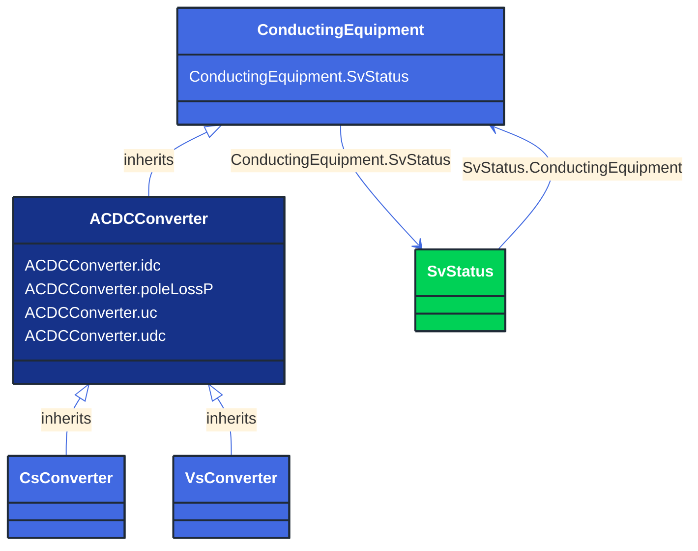

# ACDCConverter

_A unit with valves for three phases, together with unit control equipment, essential protective and switching devices, DC storage capacitors, phase reactors and auxiliaries, if any, used for conversion._

*__NOTE__: this is an abstract class and should not be instantiated directly

**URI**: [cim:ACDCConverter](http://iec.ch/TC57/CIM100#ACDCConverter) 
**Type**: Class

## Inheritance
* [ConductingEquipment](/Models/Profiles/StateVariables/AbstractClasses/ConductingEquipment/)
    * **ACDCConverter**

## Attributes
| Name | URI | Cardinality and Range | Description | Inheritance |
| ---  | --- | --- | --- | --- |
| idc | [cim:ACDCConverter.idc](http://iec.ch/TC57/CIM100#ACDCConverter.idc) | No cardinality available CurrentFlow | Converter DC current, also called Id. It is converter’s state variable, result from power flow. | direct |
| poleLossP | [cim:ACDCConverter.poleLossP](http://iec.ch/TC57/CIM100#ACDCConverter.poleLossP) | No cardinality available ActivePower | The active power loss at a DC Pole 
= idleLoss + switchingLoss*|Idc| + resitiveLoss*Idc^2.
For lossless operation Pdc=Pac.
For rectifier operation with losses Pdc=Pac-lossP.
For inverter operation with losses Pdc=Pac+lossP.
It is converter’s state variable used in power flow. The attribute shall be a positive value. | direct |
| uc | [cim:ACDCConverter.uc](http://iec.ch/TC57/CIM100#ACDCConverter.uc) | No cardinality available Voltage | Line-to-line converter voltage, the voltage at the AC side of the valve. It is converter’s state variable, result from power flow. The attribute shall be a positive value. | direct |
| udc | [cim:ACDCConverter.udc](http://iec.ch/TC57/CIM100#ACDCConverter.udc) | No cardinality available Voltage | Converter voltage at the DC side, also called Ud. It is converter’s state variable, result from power flow. The attribute shall be a positive value. | direct |
| SvStatus | [cim:ConductingEquipment.SvStatus](http://iec.ch/TC57/CIM100#ConductingEquipment.SvStatus) | No cardinality available SvStatus | The status state variable associated with this conducting equipment. | ConductingEquipment |

### Schema Source
* from schema: [http://iec.ch/TC57/ns/CIM/StateVariables-EUPackage_StateVariablesProfile](http://iec.ch/TC57/ns/CIM/StateVariables-EUPackage_StateVariablesProfile)
