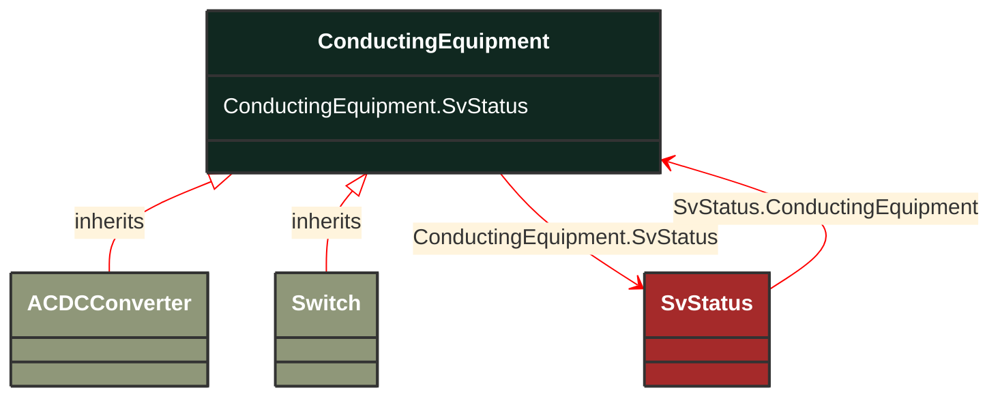

# ConductingEquipment

_The parts of the AC power system that are designed to carry current or that are conductively connected through terminals._

*__NOTE__: this is an abstract class and should not be instantiated directly

**URI**: [cim:ConductingEquipment](http://iec.ch/TC57/CIM100#ConductingEquipment) 
**Type**: Class

## Inheritance
* **ConductingEquipment**

## Attributes
| Name | URI | Cardinality and Range | Description | Inheritance |
| ---  | --- | --- | --- | --- |
| SvStatus | [cim:ConductingEquipment.SvStatus](http://iec.ch/TC57/CIM100#ConductingEquipment.SvStatus) | No cardinality available SvStatus | The status state variable associated with this conducting equipment. | direct |

### Schema Source
* from schema: [http://iec.ch/TC57/ns/CIM/StateVariables-EUPackage_StateVariablesProfile](http://iec.ch/TC57/ns/CIM/StateVariables-EUPackage_StateVariablesProfile)
