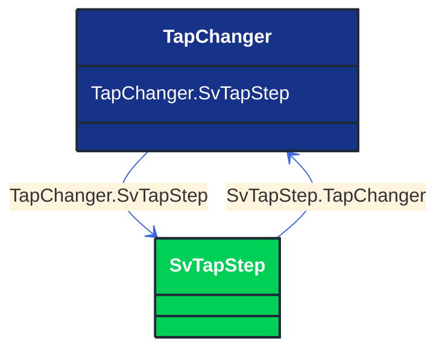

# TapChanger

_Mechanism for changing transformer winding tap positions._

*__NOTE__: this is an abstract class and should not be instantiated directly

**URI**: [cim:TapChanger](http://iec.ch/TC57/CIM100#TapChanger) 
**Type**: Class

## Inheritance
* **TapChanger**

## Attributes
| Name | URI | Cardinality and Range | Description | Inheritance |
| ---  | --- | --- | --- | --- |
| SvTapStep | [cim:TapChanger.SvTapStep](http://iec.ch/TC57/CIM100#TapChanger.SvTapStep) | No cardinality available SvTapStep | The tap step state associated with the tap changer. | direct |

### Schema Source
* from schema: [http://iec.ch/TC57/ns/CIM/StateVariables-EUPackage_StateVariablesProfile](http://iec.ch/TC57/ns/CIM/StateVariables-EUPackage_StateVariablesProfile)
