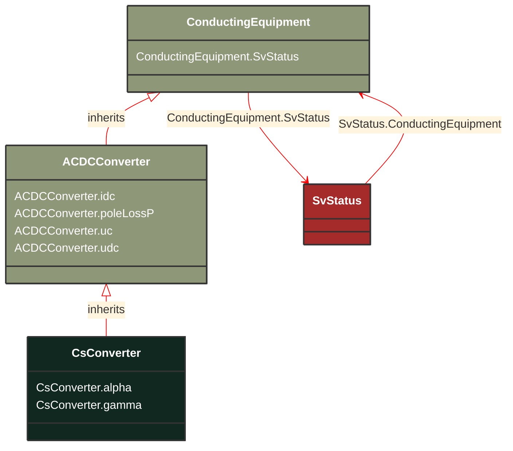

# CsConverter

_DC side of the current source converter (CSC).
The firing angle controls the dc voltage at the converter, both for rectifier and inverter. The difference between the dc voltages of the rectifier and inverter determines the dc current. The extinction angle is used to limit the dc voltage at the inverter, if needed, and is not used in active power control. The firing angle, transformer tap position and number of connected filters are the primary means to control a current source dc line. Higher level controls are built on top, e.g. dc voltage, dc current and active power. From a steady state perspective it is sufficient to specify the wanted active power transfer (ACDCConverter.targetPpcc) and the control functions will set the dc voltage, dc current, firing angle, transformer tap position and number of connected filters to meet this. Therefore attributes targetAlpha and targetGamma are not applicable in this case.
The reactive power consumed by the converter is a function of the firing angle, transformer tap position and number of connected filter, which can be approximated with half of the active power. The losses is a function of the dc voltage and dc current.
The attributes minAlpha and maxAlpha define the range of firing angles for rectifier operation between which no discrete tap changer action takes place. The range is typically 10-18 degrees.
The attributes minGamma and maxGamma define the range of extinction angles for inverter operation between which no discrete tap changer action takes place. The range is typically 17-20 degrees._

**URI**: [cim:CsConverter](http://iec.ch/TC57/CIM100#CsConverter) 
**Type**: Class

## Inheritance
* [ConductingEquipment](/Models/Profiles/StateVariables/AbstractClasses/ConductingEquipment/)
    * [ACDCConverter](/Models/Profiles/StateVariables/AbstractClasses/ACDCConverter/)
        * **CsConverter**

## Attributes
| Name | URI | Cardinality and Range | Description | Inheritance |
| ---  | --- | --- | --- | --- |
| alpha | [cim:CsConverter.alpha](http://iec.ch/TC57/CIM100#CsConverter.alpha) | No cardinality available AngleDegrees | Firing angle that determines the dc voltage at the converter dc terminal. Typical value between 10 degrees and 18 degrees for a rectifier. It is converter’s state variable, result from power flow. The attribute shall be a positive value. | direct |
| gamma | [cim:CsConverter.gamma](http://iec.ch/TC57/CIM100#CsConverter.gamma) | No cardinality available AngleDegrees | Extinction angle. It is used to limit the dc voltage at the inverter if needed. Typical value between 17 degrees and 20 degrees for an inverter. It is converter’s state variable, result from power flow. The attribute shall be a positive value. | direct |
| idc | [cim:ACDCConverter.idc](http://iec.ch/TC57/CIM100#ACDCConverter.idc) | No cardinality available CurrentFlow | Converter DC current, also called Id. It is converter’s state variable, result from power flow. | ACDCConverter |
| poleLossP | [cim:ACDCConverter.poleLossP](http://iec.ch/TC57/CIM100#ACDCConverter.poleLossP) | No cardinality available ActivePower | The active power loss at a DC Pole 
= idleLoss + switchingLoss*|Idc| + resitiveLoss*Idc^2.
For lossless operation Pdc=Pac.
For rectifier operation with losses Pdc=Pac-lossP.
For inverter operation with losses Pdc=Pac+lossP.
It is converter’s state variable used in power flow. The attribute shall be a positive value. | ACDCConverter |
| uc | [cim:ACDCConverter.uc](http://iec.ch/TC57/CIM100#ACDCConverter.uc) | No cardinality available Voltage | Line-to-line converter voltage, the voltage at the AC side of the valve. It is converter’s state variable, result from power flow. The attribute shall be a positive value. | ACDCConverter |
| udc | [cim:ACDCConverter.udc](http://iec.ch/TC57/CIM100#ACDCConverter.udc) | No cardinality available Voltage | Converter voltage at the DC side, also called Ud. It is converter’s state variable, result from power flow. The attribute shall be a positive value. | ACDCConverter |
| SvStatus | [cim:ConductingEquipment.SvStatus](http://iec.ch/TC57/CIM100#ConductingEquipment.SvStatus) | No cardinality available SvStatus | The status state variable associated with this conducting equipment. | ConductingEquipment |

### Schema Source
* from schema: [http://iec.ch/TC57/ns/CIM/StateVariables-EUPackage_StateVariablesProfile](http://iec.ch/TC57/ns/CIM/StateVariables-EUPackage_StateVariablesProfile)
