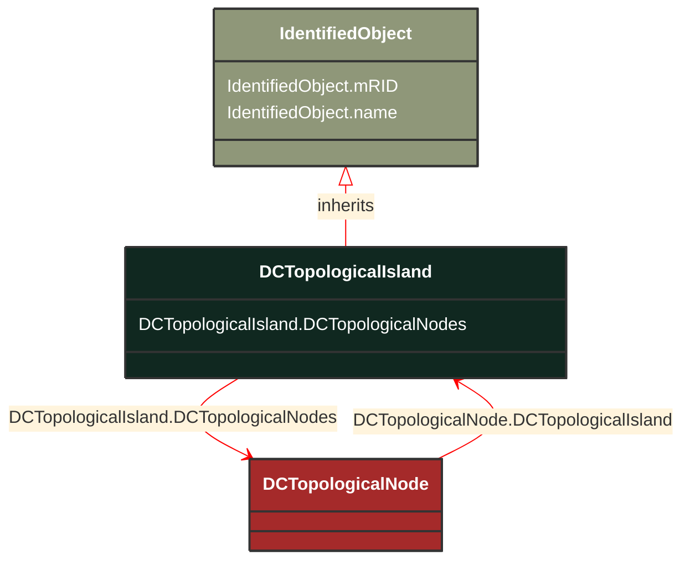

# DCTopologicalIsland

_An electrically connected subset of the network. DC topological islands can change as the current network state changes, e.g. due to: 
- disconnect switches or breakers changing state in a SCADA/EMS.
- manual creation, change or deletion of topological nodes in a planning tool.
Only energised TopologicalNode-s shall be part of the topological island._

**URI**: [cim:DCTopologicalIsland](http://iec.ch/TC57/CIM100#DCTopologicalIsland) 
**Type**: Class

## Inheritance
* [IdentifiedObject](/Models/Profiles/StateVariables/AbstractClasses/IdentifiedObject/)
    * **DCTopologicalIsland**

## Attributes
| Name | URI | Cardinality and Range | Description | Inheritance |
| ---  | --- | --- | --- | --- |
| DCTopologicalNodes | [cim:DCTopologicalIsland.DCTopologicalNodes](http://iec.ch/TC57/CIM100#DCTopologicalIsland.DCTopologicalNodes) | No cardinality available DCTopologicalNode | The DC topological nodes in a DC topological island. | direct |
| mRID | [cim:IdentifiedObject.mRID](http://iec.ch/TC57/CIM100#IdentifiedObject.mRID) | No cardinality available string | Master resource identifier issued by a model authority. The mRID is unique within an exchange context. Global uniqueness is easily achieved by using a UUID, as specified in RFC 4122, for the mRID. The use of UUID is strongly recommended.
For CIMXML data files in RDF syntax conforming to IEC 61970-552, the mRID is mapped to rdf:ID or rdf:about attributes that identify CIM object elements. | IdentifiedObject |
| name | [cim:IdentifiedObject.name](http://iec.ch/TC57/CIM100#IdentifiedObject.name) | No cardinality available string | The name is any free human readable and possibly non unique text naming the object. | IdentifiedObject |

### Schema Source
* from schema: [http://iec.ch/TC57/ns/CIM/StateVariables-EUPackage_StateVariablesProfile](http://iec.ch/TC57/ns/CIM/StateVariables-EUPackage_StateVariablesProfile)
