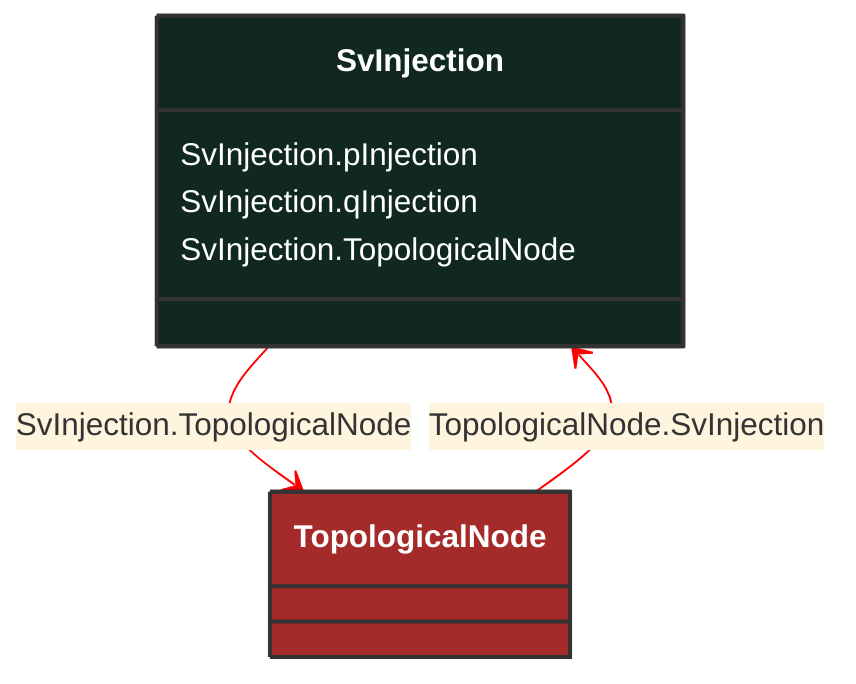

# SvInjection

_The SvInjection reports the calculated bus injection minus the sum of the terminal flows. The terminal flow is positive out from the bus (load sign convention) and bus injection has positive flow into the bus. SvInjection may have the remainder after state estimation or slack after power flow calculation._

**URI**: [cim:SvInjection](http://iec.ch/TC57/CIM100#SvInjection) 
**Type**: Class

## Inheritance
* **SvInjection**

## Attributes
| Name | URI | Cardinality and Range | Description | Inheritance |
| ---  | --- | --- | --- | --- |
| pInjection | [cim:SvInjection.pInjection](http://iec.ch/TC57/CIM100#SvInjection.pInjection) | No cardinality available ActivePower | The active power mismatch between calculated injection and initial injection.  Positive sign means injection into the TopologicalNode (bus). | direct |
| qInjection | [cim:SvInjection.qInjection](http://iec.ch/TC57/CIM100#SvInjection.qInjection) | No cardinality available ReactivePower | The reactive power mismatch between calculated injection and initial injection.  Positive sign means injection into the TopologicalNode (bus). | direct |
| TopologicalNode | [cim:SvInjection.TopologicalNode](http://iec.ch/TC57/CIM100#SvInjection.TopologicalNode) | No cardinality available TopologicalNode | The topological node associated with the flow injection state variable. | direct |

### Schema Source
* from schema: [http://iec.ch/TC57/ns/CIM/StateVariables-EUPackage_StateVariablesProfile](http://iec.ch/TC57/ns/CIM/StateVariables-EUPackage_StateVariablesProfile)
