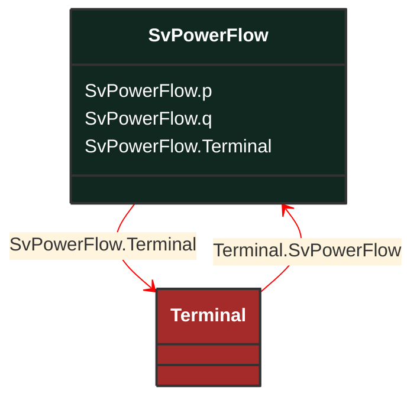

# SvPowerFlow

_State variable for power flow. Load convention is used for flow direction. This means flow out from the TopologicalNode into the equipment is positive._

**URI**: [cim:SvPowerFlow](http://iec.ch/TC57/CIM100#SvPowerFlow) 
**Type**: Class

## Inheritance
* **SvPowerFlow**

## Attributes
| Name | URI | Cardinality and Range | Description | Inheritance |
| ---  | --- | --- | --- | --- |
| p | [cim:SvPowerFlow.p](http://iec.ch/TC57/CIM100#SvPowerFlow.p) | No cardinality available ActivePower | The active power flow. Load sign convention is used, i.e. positive sign means flow out from a TopologicalNode (bus) into the conducting equipment. | direct |
| q | [cim:SvPowerFlow.q](http://iec.ch/TC57/CIM100#SvPowerFlow.q) | No cardinality available ReactivePower | The reactive power flow. Load sign convention is used, i.e. positive sign means flow out from a TopologicalNode (bus) into the conducting equipment. | direct |
| Terminal | [cim:SvPowerFlow.Terminal](http://iec.ch/TC57/CIM100#SvPowerFlow.Terminal) | No cardinality available Terminal | The terminal associated with the power flow state variable. | direct |

### Schema Source
* from schema: [http://iec.ch/TC57/ns/CIM/StateVariables-EUPackage_StateVariablesProfile](http://iec.ch/TC57/ns/CIM/StateVariables-EUPackage_StateVariablesProfile)
