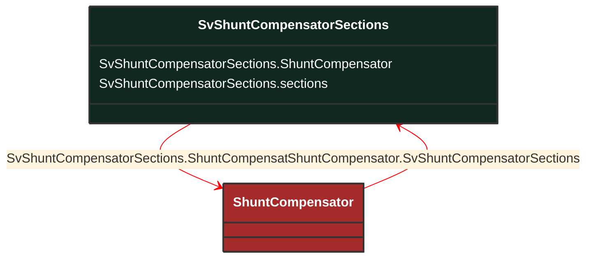

# SvShuntCompensatorSections

_State variable for the number of sections in service for a shunt compensator._

**URI**: [cim:SvShuntCompensatorSections](http://iec.ch/TC57/CIM100#SvShuntCompensatorSections) 
**Type**: Class

## Inheritance
* **SvShuntCompensatorSections**

## Attributes
| Name | URI | Cardinality and Range | Description | Inheritance |
| ---  | --- | --- | --- | --- |
| ShuntCompensator | [cim:SvShuntCompensatorSections.ShuntCompensator](http://iec.ch/TC57/CIM100#SvShuntCompensatorSections.ShuntCompensator) | No cardinality available ShuntCompensator | The shunt compensator for which the state applies. | direct |
| sections | [cim:SvShuntCompensatorSections.sections](http://iec.ch/TC57/CIM100#SvShuntCompensatorSections.sections) | No cardinality available float | The number of sections in service as a continuous variable. The attribute shall be a positive value or zero. To get integer value scale with ShuntCompensator.bPerSection. | direct |

### Schema Source
* from schema: [http://iec.ch/TC57/ns/CIM/StateVariables-EUPackage_StateVariablesProfile](http://iec.ch/TC57/ns/CIM/StateVariables-EUPackage_StateVariablesProfile)
