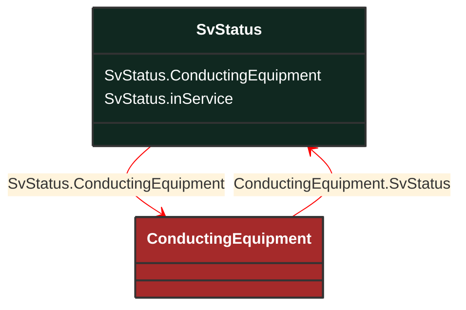

# SvStatus

_State variable for status._

**URI**: [cim:SvStatus](http://iec.ch/TC57/CIM100#SvStatus) 
**Type**: Class

## Inheritance
* **SvStatus**

## Attributes
| Name | URI | Cardinality and Range | Description | Inheritance |
| ---  | --- | --- | --- | --- |
| ConductingEquipment | [cim:SvStatus.ConductingEquipment](http://iec.ch/TC57/CIM100#SvStatus.ConductingEquipment) | No cardinality available ConductingEquipment | The conducting equipment associated with the status state variable. | direct |
| inService | [cim:SvStatus.inService](http://iec.ch/TC57/CIM100#SvStatus.inService) | No cardinality available boolean | The in service status as a result of topology processing.  It indicates if the equipment is considered as energized by the power flow. It reflects if the equipment is connected within a solvable island.  It does not necessarily reflect whether or not the island was solved by the power flow. | direct |

### Schema Source
* from schema: [http://iec.ch/TC57/ns/CIM/StateVariables-EUPackage_StateVariablesProfile](http://iec.ch/TC57/ns/CIM/StateVariables-EUPackage_StateVariablesProfile)
