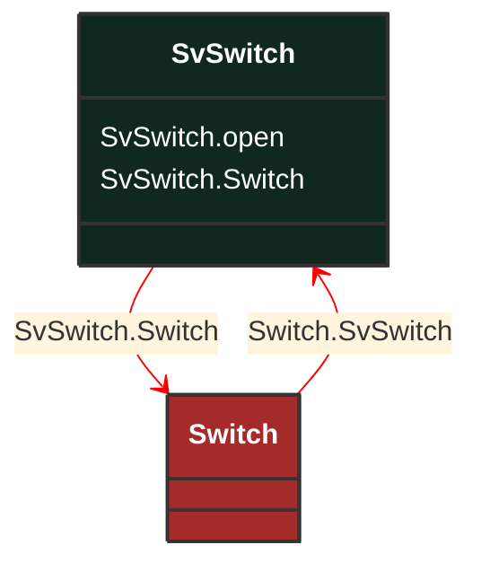

# SvSwitch

_State variable for switch._

**URI**: [cim:SvSwitch](http://iec.ch/TC57/CIM100#SvSwitch) 
**Type**: Class

## Inheritance
* **SvSwitch**

## Attributes
| Name | URI | Cardinality and Range | Description | Inheritance |
| ---  | --- | --- | --- | --- |
| open | [cim:SvSwitch.open](http://iec.ch/TC57/CIM100#SvSwitch.open) | No cardinality available boolean | The attribute tells if the computed state of the switch is considered open. | direct |
| Switch | [cim:SvSwitch.Switch](http://iec.ch/TC57/CIM100#SvSwitch.Switch) | No cardinality available Switch | The switch associated with the switch state. | direct |

### Schema Source
* from schema: [http://iec.ch/TC57/ns/CIM/StateVariables-EUPackage_StateVariablesProfile](http://iec.ch/TC57/ns/CIM/StateVariables-EUPackage_StateVariablesProfile)
