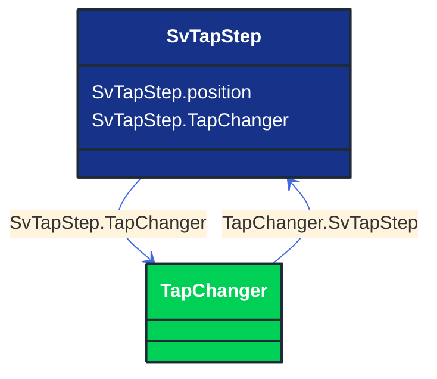

# SvTapStep

_State variable for transformer tap step._

**URI**: [cim:SvTapStep](http://iec.ch/TC57/CIM100#SvTapStep) 
**Type**: Class

## Inheritance
* **SvTapStep**

## Attributes
| Name | URI | Cardinality and Range | Description | Inheritance |
| ---  | --- | --- | --- | --- |
| position | [cim:SvTapStep.position](http://iec.ch/TC57/CIM100#SvTapStep.position) | No cardinality available float | The floating point tap position.   This is not the tap ratio, but rather the tap step position as defined by the related tap changer model and normally is constrained to be within the range of minimum and maximum tap positions. | direct |
| TapChanger | [cim:SvTapStep.TapChanger](http://iec.ch/TC57/CIM100#SvTapStep.TapChanger) | No cardinality available TapChanger | The tap changer associated with the tap step state. | direct |

### Schema Source
* from schema: [http://iec.ch/TC57/ns/CIM/StateVariables-EUPackage_StateVariablesProfile](http://iec.ch/TC57/ns/CIM/StateVariables-EUPackage_StateVariablesProfile)
