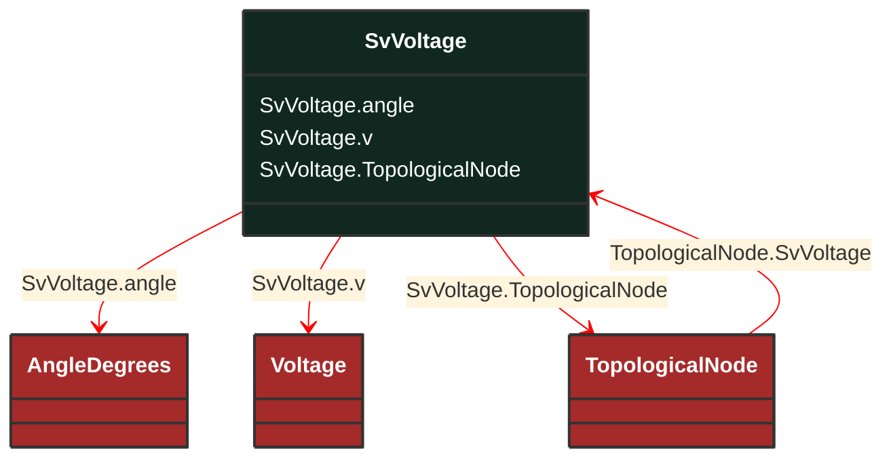

# SvVoltage

_State variable for voltage._

**URI**: [cim:SvVoltage](http://iec.ch/TC57/CIM100#SvVoltage) 
**Type**: Class

## Inheritance
* **SvVoltage**

## Attributes
| Name | URI | Cardinality and Range | Description | Inheritance |
| ---  | --- | --- | --- | --- |
| angle | [cim:SvVoltage.angle](http://iec.ch/TC57/CIM100#SvVoltage.angle) | No cardinality available AngleDegrees | The voltage angle of the topological node complex voltage with respect to system reference. | direct |
| v | [cim:SvVoltage.v](http://iec.ch/TC57/CIM100#SvVoltage.v) | No cardinality available Voltage | The voltage magnitude at the topological node. The attribute shall be a positive value. | direct |
| TopologicalNode | [cim:SvVoltage.TopologicalNode](http://iec.ch/TC57/CIM100#SvVoltage.TopologicalNode) | No cardinality available TopologicalNode | The topological node associated with the voltage state. | direct |

### Schema Source
* from schema: [http://iec.ch/TC57/ns/CIM/StateVariables-EUPackage_StateVariablesProfile](http://iec.ch/TC57/ns/CIM/StateVariables-EUPackage_StateVariablesProfile)
