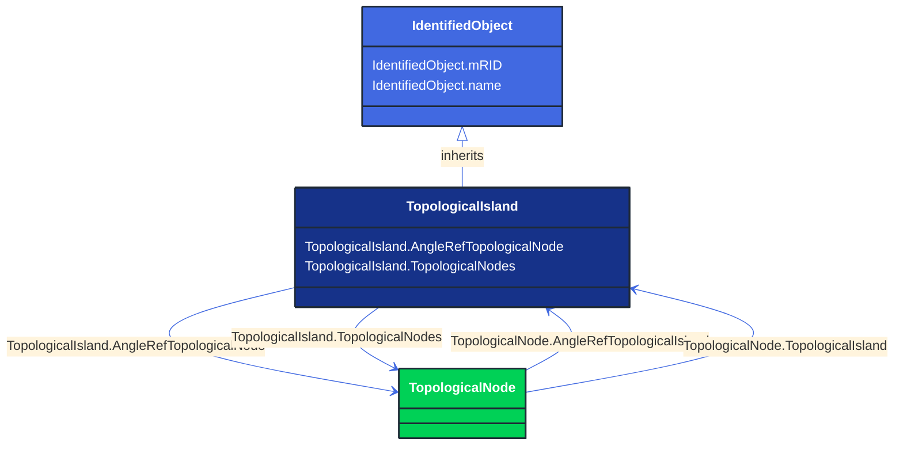

# TopologicalIsland

_An electrically connected subset of the network. Topological islands can change as the current network state changes, e.g. due to: 
- disconnect switches or breakers changing state in a SCADA/EMS.
- manual creation, change or deletion of topological nodes in a planning tool.
Only energised TopologicalNode-s shall be part of the topological island._

**URI**: [cim:TopologicalIsland](http://iec.ch/TC57/CIM100#TopologicalIsland) 
**Type**: Class

## Inheritance
* [IdentifiedObject](/Models/Profiles/StateVariables/AbstractClasses/IdentifiedObject/)
    * **TopologicalIsland**

## Attributes
| Name | URI | Cardinality and Range | Description | Inheritance |
| ---  | --- | --- | --- | --- |
| AngleRefTopologicalNode | [cim:TopologicalIsland.AngleRefTopologicalNode](http://iec.ch/TC57/CIM100#TopologicalIsland.AngleRefTopologicalNode) | No cardinality available TopologicalNode | The angle reference for the island.   Normally there is one TopologicalNode that is selected as the angle reference for each island.   Other reference schemes exist, so the association is typically optional. | direct |
| TopologicalNodes | [cim:TopologicalIsland.TopologicalNodes](http://iec.ch/TC57/CIM100#TopologicalIsland.TopologicalNodes) | No cardinality available TopologicalNode | A topological node belongs to a topological island. | direct |
| mRID | [cim:IdentifiedObject.mRID](http://iec.ch/TC57/CIM100#IdentifiedObject.mRID) | No cardinality available string | Master resource identifier issued by a model authority. The mRID is unique within an exchange context. Global uniqueness is easily achieved by using a UUID, as specified in RFC 4122, for the mRID. The use of UUID is strongly recommended.
For CIMXML data files in RDF syntax conforming to IEC 61970-552, the mRID is mapped to rdf:ID or rdf:about attributes that identify CIM object elements. | IdentifiedObject |
| name | [cim:IdentifiedObject.name](http://iec.ch/TC57/CIM100#IdentifiedObject.name) | No cardinality available string | The name is any free human readable and possibly non unique text naming the object. | IdentifiedObject |

### Schema Source
* from schema: [http://iec.ch/TC57/ns/CIM/StateVariables-EUPackage_StateVariablesProfile](http://iec.ch/TC57/ns/CIM/StateVariables-EUPackage_StateVariablesProfile)
