# TopologicalNode

_For a detailed substation model a topological node is a set of connectivity nodes that, in the current network state, are connected together through any type of closed switches, including  jumpers. Topological nodes change as the current network state changes (i.e., switches, breakers, etc. change state).
For a planning model, switch statuses are not used to form topological nodes. Instead they are manually created or deleted in a model builder tool. Topological nodes maintained this way are also called "busses"._

**URI**: [cim:TopologicalNode](http://iec.ch/TC57/CIM100#TopologicalNode) 
**Type**: Class

```mermaid
%%{init: {'theme':'base','themeVariables': {'lineColor': '#4169E1'}}}%%
classDiagram
    class TopologicalNode
    click TopologicalNode href "/Models/Profiles/StateVariables/ConcreteClasses/TopologicalNode/"
    style TopologicalNode fill:#163289,stroke:#1F2A37,stroke-width:2px,rx:10,ry:10,color:white

        TopologicalNode --> SvInjection : TopologicalNode.SvInjection

        SvInjection
            click SvInjection href "/Models/Profiles/StateVariables/ConcreteClasses/SvInjection/"
            style SvInjection fill:#00D156,stroke:#1F2A37,stroke-width:2px,rx:10,ry:10,color:white
        TopologicalNode --> SvVoltage : TopologicalNode.SvVoltage

        SvVoltage
            click SvVoltage href "/Models/Profiles/StateVariables/ConcreteClasses/SvVoltage/"
            style SvVoltage fill:#00D156,stroke:#1F2A37,stroke-width:2px,rx:10,ry:10,color:white
        TopologicalNode --> TopologicalIsland : TopologicalNode.AngleRefTopologicalIsland

        TopologicalIsland
            click TopologicalIsland href "/Models/Profiles/StateVariables/ConcreteClasses/TopologicalIsland/"
            style TopologicalIsland fill:#00D156,stroke:#1F2A37,stroke-width:2px,rx:10,ry:10,color:white
        TopologicalNode --> TopologicalIsland : TopologicalNode.TopologicalIsland

        TopologicalIsland
            click TopologicalIsland href "/Models/Profiles/StateVariables/ConcreteClasses/TopologicalIsland/"
            style TopologicalIsland fill:#00D156,stroke:#1F2A37,stroke-width:2px,rx:10,ry:10,color:white

        SvInjection --> TopologicalNode : SvInjection.TopologicalNode

        SvInjection
            click SvInjection href "/Models/Profiles/StateVariables/ConcreteClasses/SvInjection/"
            style SvInjection fill:#00D156,stroke:#1F2A37,stroke-width:2px,rx:10,ry:10,color:white

        SvVoltage --> TopologicalNode : SvVoltage.TopologicalNode

        SvVoltage
            click SvVoltage href "/Models/Profiles/StateVariables/ConcreteClasses/SvVoltage/"
            style SvVoltage fill:#00D156,stroke:#1F2A37,stroke-width:2px,rx:10,ry:10,color:white

        TopologicalIsland --> TopologicalNode : TopologicalIsland.AngleRefTopologicalNode

        TopologicalIsland
            click TopologicalIsland href "/Models/Profiles/StateVariables/ConcreteClasses/TopologicalIsland/"
            style TopologicalIsland fill:#00D156,stroke:#1F2A37,stroke-width:2px,rx:10,ry:10,color:white

        TopologicalIsland --> TopologicalNode : TopologicalIsland.TopologicalNodes

        TopologicalIsland
            click TopologicalIsland href "/Models/Profiles/StateVariables/ConcreteClasses/TopologicalIsland/"
            style TopologicalIsland fill:#00D156,stroke:#1F2A37,stroke-width:2px,rx:10,ry:10,color:white


        TopologicalNode : TopologicalNode.SvInjection
        TopologicalNode : TopologicalNode.SvVoltage
        TopologicalNode : TopologicalNode.AngleRefTopologicalIsland
        TopologicalNode : TopologicalNode.TopologicalIsland
```

## Inheritance
* **TopologicalNode**

## Attributes
| Name | URI | Cardinality and Range | Description | Inheritance |
| ---  | --- | --- | --- | --- |
| SvInjection | [cim:TopologicalNode.SvInjection](http://iec.ch/TC57/CIM100#TopologicalNode.SvInjection) | No cardinality available SvInjection | The injection flows state variables associated with the topological node. | direct |
| SvVoltage | [cim:TopologicalNode.SvVoltage](http://iec.ch/TC57/CIM100#TopologicalNode.SvVoltage) | No cardinality available SvVoltage | The state voltage associated with the topological node. | direct |
| AngleRefTopologicalIsland | [cim:TopologicalNode.AngleRefTopologicalIsland](http://iec.ch/TC57/CIM100#TopologicalNode.AngleRefTopologicalIsland) | No cardinality available TopologicalIsland | The island for which the node is an angle reference.   Normally there is one angle reference node for each island. | direct |
| TopologicalIsland | [cim:TopologicalNode.TopologicalIsland](http://iec.ch/TC57/CIM100#TopologicalNode.TopologicalIsland) | No cardinality available TopologicalIsland | A topological node belongs to a topological island. | direct |

### Schema Source
* from schema: [http://iec.ch/TC57/ns/CIM/StateVariables-EUPackage_StateVariablesProfile](http://iec.ch/TC57/ns/CIM/StateVariables-EUPackage_StateVariablesProfile)
