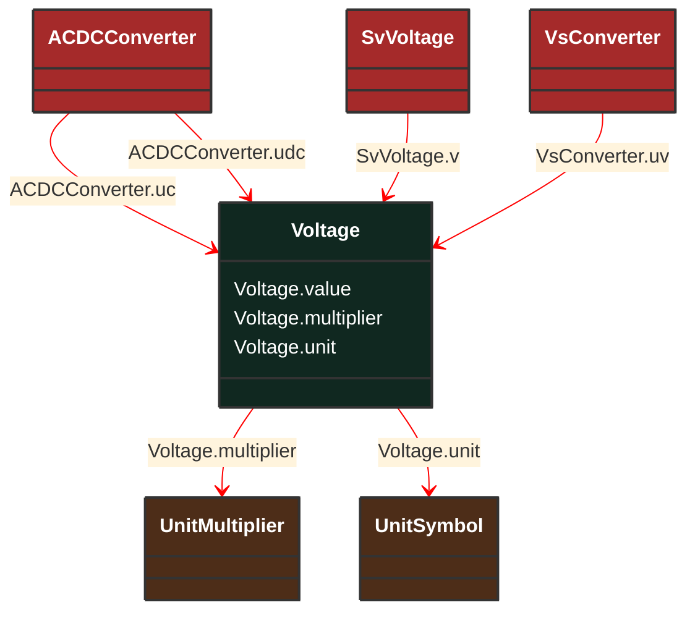

# Voltage

_Electrical voltage, can be both AC and DC._

**URI**: [cim:Voltage](http://iec.ch/TC57/CIM100#Voltage) 
**Type**: Class

## Inheritance
* **Voltage**

## Attributes
| Name | URI | Cardinality and Range | Description | Inheritance |
| ---  | --- | --- | --- | --- |
| value | [cim:Voltage.value](http://iec.ch/TC57/CIM100#Voltage.value) | No cardinality available float | No description available | direct |
| multiplier | [cim:Voltage.multiplier](http://iec.ch/TC57/CIM100#Voltage.multiplier) | No cardinality available UnitMultiplier | No description available | direct |
| unit | [cim:Voltage.unit](http://iec.ch/TC57/CIM100#Voltage.unit) | No cardinality available UnitSymbol | No description available | direct |

### Schema Source
* from schema: [http://iec.ch/TC57/ns/CIM/StateVariables-EUPackage_StateVariablesProfile](http://iec.ch/TC57/ns/CIM/StateVariables-EUPackage_StateVariablesProfile)
