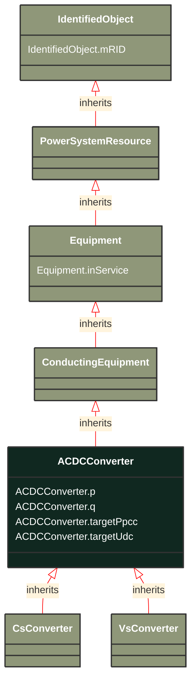

# ACDCConverter

_A unit with valves for three phases, together with unit control equipment, essential protective and switching devices, DC storage capacitors, phase reactors and auxiliaries, if any, used for conversion._

**URI**: [cim:ACDCConverter](http://iec.ch/TC57/CIM100#ACDCConverter) 
**Type**: Class

## Inheritance
* [IdentifiedObject](/Models/Profiles/SteadyStateHypothesis/ConcreteClasses/IdentifiedObject/)
    * [PowerSystemResource](/Models/Profiles/SteadyStateHypothesis/ConcreteClasses/PowerSystemResource/)
        * [Equipment](/Models/Profiles/SteadyStateHypothesis/ConcreteClasses/Equipment/)
            * [ConductingEquipment](/Models/Profiles/SteadyStateHypothesis/ConcreteClasses/ConductingEquipment/)
                * **ACDCConverter**

## Attributes
| Name | URI | Cardinality and Range | Description | Inheritance |
| ---  | --- | --- | --- | --- |
| p | [cim:ACDCConverter.p](http://iec.ch/TC57/CIM100#ACDCConverter.p) | No cardinality available ActivePower | Active power at the point of common coupling. Load sign convention is used, i.e. positive sign means flow out from a node.
Starting value for a steady state solution in the case a simplified power flow model is used. | direct |
| q | [cim:ACDCConverter.q](http://iec.ch/TC57/CIM100#ACDCConverter.q) | No cardinality available ReactivePower | Reactive power at the point of common coupling. Load sign convention is used, i.e. positive sign means flow out from a node.
Starting value for a steady state solution in the case a simplified power flow model is used. | direct |
| targetPpcc | [cim:ACDCConverter.targetPpcc](http://iec.ch/TC57/CIM100#ACDCConverter.targetPpcc) | No cardinality available ActivePower | Real power injection target in AC grid, at point of common coupling.  Load sign convention is used, i.e. positive sign means flow out from a node. | direct |
| targetUdc | [cim:ACDCConverter.targetUdc](http://iec.ch/TC57/CIM100#ACDCConverter.targetUdc) | No cardinality available Voltage | Target value for DC voltage magnitude. The attribute shall be a positive value. | direct |
| inService | [cim:Equipment.inService](http://iec.ch/TC57/CIM100#Equipment.inService) | No cardinality available boolean | Specifies the availability of the equipment. True means the equipment is available for topology processing, which determines if the equipment is energized or not. False means that the equipment is treated by network applications as if it is not in the model. | Equipment |
| mRID | [cim:IdentifiedObject.mRID](http://iec.ch/TC57/CIM100#IdentifiedObject.mRID) | No cardinality available string | Master resource identifier issued by a model authority. The mRID is unique within an exchange context. Global uniqueness is easily achieved by using a UUID, as specified in RFC 4122, for the mRID. The use of UUID is strongly recommended.
For CIMXML data files in RDF syntax conforming to IEC 61970-552, the mRID is mapped to rdf:ID or rdf:about attributes that identify CIM object elements. | IdentifiedObject |

### Schema Source
* from schema: [http://iec.ch/TC57/ns/CIM/SteadyStateHypothesis-EUPackage_SteadyStateHypothesisProfile](http://iec.ch/TC57/ns/CIM/SteadyStateHypothesis-EUPackage_SteadyStateHypothesisProfile)
