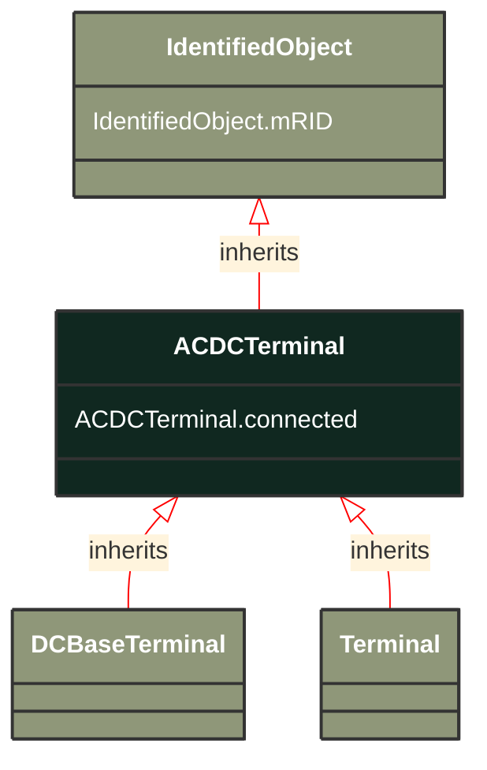

# ACDCTerminal

_An electrical connection point (AC or DC) to a piece of conducting equipment. Terminals are connected at physical connection points called connectivity nodes._

**URI**: [cim:ACDCTerminal](http://iec.ch/TC57/CIM100#ACDCTerminal) 
**Type**: Class

## Inheritance
* [IdentifiedObject](/Models/Profiles/SteadyStateHypothesis/ConcreteClasses/IdentifiedObject/)
    * **ACDCTerminal**

## Attributes
| Name | URI | Cardinality and Range | Description | Inheritance |
| ---  | --- | --- | --- | --- |
| connected | [cim:ACDCTerminal.connected](http://iec.ch/TC57/CIM100#ACDCTerminal.connected) | No cardinality available boolean | The connected status is related to a bus-branch model and the topological node to terminal relation.  True implies the terminal is connected to the related topological node and false implies it is not. 
In a bus-branch model, the connected status is used to tell if equipment is disconnected without having to change the connectivity described by the topological node to terminal relation. A valid case is that conducting equipment can be connected in one end and open in the other. In particular for an AC line segment, where the reactive line charging can be significant, this is a relevant case. | direct |
| mRID | [cim:IdentifiedObject.mRID](http://iec.ch/TC57/CIM100#IdentifiedObject.mRID) | No cardinality available string | Master resource identifier issued by a model authority. The mRID is unique within an exchange context. Global uniqueness is easily achieved by using a UUID, as specified in RFC 4122, for the mRID. The use of UUID is strongly recommended.
For CIMXML data files in RDF syntax conforming to IEC 61970-552, the mRID is mapped to rdf:ID or rdf:about attributes that identify CIM object elements. | IdentifiedObject |

### Schema Source
* from schema: [http://iec.ch/TC57/ns/CIM/SteadyStateHypothesis-EUPackage_SteadyStateHypothesisProfile](http://iec.ch/TC57/ns/CIM/SteadyStateHypothesis-EUPackage_SteadyStateHypothesisProfile)
