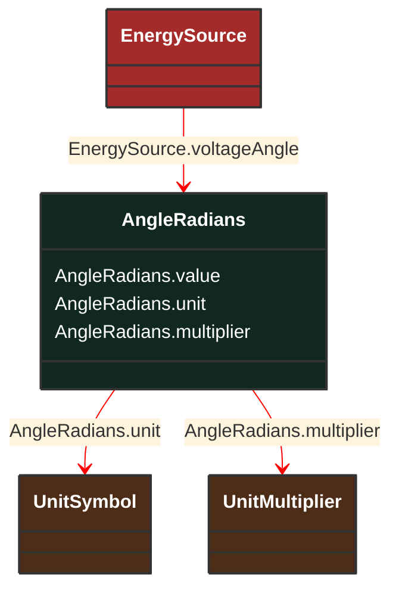

# AngleRadians

_Phase angle in radians._

**URI**: [cim:AngleRadians](http://iec.ch/TC57/CIM100#AngleRadians) 
**Type**: Class

## Inheritance
* **AngleRadians**

## Attributes
| Name | URI | Cardinality and Range | Description | Inheritance |
| ---  | --- | --- | --- | --- |
| value | [cim:AngleRadians.value](http://iec.ch/TC57/CIM100#AngleRadians.value) | No cardinality available float | No description available | direct |
| unit | [cim:AngleRadians.unit](http://iec.ch/TC57/CIM100#AngleRadians.unit) | No cardinality available UnitSymbol | No description available | direct |
| multiplier | [cim:AngleRadians.multiplier](http://iec.ch/TC57/CIM100#AngleRadians.multiplier) | No cardinality available UnitMultiplier | No description available | direct |

### Schema Source
* from schema: [http://iec.ch/TC57/ns/CIM/SteadyStateHypothesis-EUPackage_SteadyStateHypothesisProfile](http://iec.ch/TC57/ns/CIM/SteadyStateHypothesis-EUPackage_SteadyStateHypothesisProfile)
