# ConductingEquipment

_The parts of the AC power system that are designed to carry current or that are conductively connected through terminals._

**URI**: [cim:ConductingEquipment](http://iec.ch/TC57/CIM100#ConductingEquipment) 
**Type**: Class

```mermaid
%%{init: {'theme':'base','themeVariables': {'lineColor': '#FF0000'}}}%%
classDiagram
    class ConductingEquipment
    click ConductingEquipment href "/Models/Profiles/SteadyStateHypothesis/ConcreteClasses/ConductingEquipment/"
    style ConductingEquipment fill:#102820,stroke:#333,stroke-width:2px,rx:10,ry:10,color:white

        ConductingEquipment <|-- ACDCConverter : inherits

        ACDCConverter
            click ACDCConverter href "/Models/Profiles/SteadyStateHypothesis/ConcreteClasses/ACDCConverter/"
            style ACDCConverter fill:#8F9779,stroke:#333,stroke-width:2px,rx:10,ry:10,color:white

        ConductingEquipment <|-- EnergyConnection : inherits

        EnergyConnection
            click EnergyConnection href "/Models/Profiles/SteadyStateHypothesis/ConcreteClasses/EnergyConnection/"
            style EnergyConnection fill:#8F9779,stroke:#333,stroke-width:2px,rx:10,ry:10,color:white

        ConductingEquipment <|-- EquivalentEquipment : inherits

        EquivalentEquipment
            click EquivalentEquipment href "/Models/Profiles/SteadyStateHypothesis/ConcreteClasses/EquivalentEquipment/"
            style EquivalentEquipment fill:#8F9779,stroke:#333,stroke-width:2px,rx:10,ry:10,color:white

        ConductingEquipment <|-- Switch : inherits

        Switch
            click Switch href "/Models/Profiles/SteadyStateHypothesis/ConcreteClasses/Switch/"
            style Switch fill:#8F9779,stroke:#333,stroke-width:2px,rx:10,ry:10,color:white
     
        Equipment <|-- ConductingEquipment : inherits
            click Equipment href "/Models/Profiles/SteadyStateHypothesis/ConcreteClasses/Equipment/"
            style Equipment fill:#8F9779,stroke:#333,stroke-width:2px,rx:10,ry:10,color:white
     
        PowerSystemResource <|-- Equipment : inherits
            click PowerSystemResource href "/Models/Profiles/SteadyStateHypothesis/ConcreteClasses/PowerSystemResource/"
            style PowerSystemResource fill:#8F9779,stroke:#333,stroke-width:2px,rx:10,ry:10,color:white
     
        IdentifiedObject <|-- PowerSystemResource : inherits
            click IdentifiedObject href "/Models/Profiles/SteadyStateHypothesis/ConcreteClasses/IdentifiedObject/"
            style IdentifiedObject fill:#8F9779,stroke:#333,stroke-width:2px,rx:10,ry:10,color:white



        Equipment : Equipment.inService
        IdentifiedObject : IdentifiedObject.mRID
```

## Inheritance
* [IdentifiedObject](/Models/Profiles/SteadyStateHypothesis/ConcreteClasses/IdentifiedObject/)
    * [PowerSystemResource](/Models/Profiles/SteadyStateHypothesis/ConcreteClasses/PowerSystemResource/)
        * [Equipment](/Models/Profiles/SteadyStateHypothesis/ConcreteClasses/Equipment/)
            * **ConductingEquipment**

## Attributes
| Name | URI | Cardinality and Range | Description | Inheritance |
| ---  | --- | --- | --- | --- |
| inService | [cim:Equipment.inService](http://iec.ch/TC57/CIM100#Equipment.inService) | No cardinality available boolean | Specifies the availability of the equipment. True means the equipment is available for topology processing, which determines if the equipment is energized or not. False means that the equipment is treated by network applications as if it is not in the model. | Equipment |
| mRID | [cim:IdentifiedObject.mRID](http://iec.ch/TC57/CIM100#IdentifiedObject.mRID) | No cardinality available string | Master resource identifier issued by a model authority. The mRID is unique within an exchange context. Global uniqueness is easily achieved by using a UUID, as specified in RFC 4122, for the mRID. The use of UUID is strongly recommended.
For CIMXML data files in RDF syntax conforming to IEC 61970-552, the mRID is mapped to rdf:ID or rdf:about attributes that identify CIM object elements. | IdentifiedObject |

### Schema Source
* from schema: [http://iec.ch/TC57/ns/CIM/SteadyStateHypothesis-EUPackage_SteadyStateHypothesisProfile](http://iec.ch/TC57/ns/CIM/SteadyStateHypothesis-EUPackage_SteadyStateHypothesisProfile)
