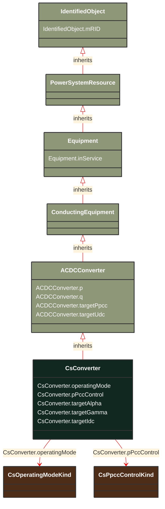

# CsConverter

_DC side of the current source converter (CSC).
The firing angle controls the dc voltage at the converter, both for rectifier and inverter. The difference between the dc voltages of the rectifier and inverter determines the dc current. The extinction angle is used to limit the dc voltage at the inverter, if needed, and is not used in active power control. The firing angle, transformer tap position and number of connected filters are the primary means to control a current source dc line. Higher level controls are built on top, e.g. dc voltage, dc current and active power. From a steady state perspective it is sufficient to specify the wanted active power transfer (ACDCConverter.targetPpcc) and the control functions will set the dc voltage, dc current, firing angle, transformer tap position and number of connected filters to meet this. Therefore attributes targetAlpha and targetGamma are not applicable in this case.
The reactive power consumed by the converter is a function of the firing angle, transformer tap position and number of connected filter, which can be approximated with half of the active power. The losses is a function of the dc voltage and dc current.
The attributes minAlpha and maxAlpha define the range of firing angles for rectifier operation between which no discrete tap changer action takes place. The range is typically 10-18 degrees.
The attributes minGamma and maxGamma define the range of extinction angles for inverter operation between which no discrete tap changer action takes place. The range is typically 17-20 degrees._

**URI**: [cim:CsConverter](http://iec.ch/TC57/CIM100#CsConverter) 
**Type**: Class

## Inheritance
* [IdentifiedObject](/Models/Profiles/SteadyStateHypothesis/ConcreteClasses/IdentifiedObject/)
    * [PowerSystemResource](/Models/Profiles/SteadyStateHypothesis/ConcreteClasses/PowerSystemResource/)
        * [Equipment](/Models/Profiles/SteadyStateHypothesis/ConcreteClasses/Equipment/)
            * [ConductingEquipment](/Models/Profiles/SteadyStateHypothesis/ConcreteClasses/ConductingEquipment/)
                * [ACDCConverter](/Models/Profiles/SteadyStateHypothesis/ConcreteClasses/ACDCConverter/)
                    * **CsConverter**

## Attributes
| Name | URI | Cardinality and Range | Description | Inheritance |
| ---  | --- | --- | --- | --- |
| operatingMode | [cim:CsConverter.operatingMode](http://iec.ch/TC57/CIM100#CsConverter.operatingMode) | No cardinality available CsOperatingModeKind | Indicates whether the DC pole is operating as an inverter or as a rectifier. It is converter’s control variable used in power flow. | direct |
| pPccControl | [cim:CsConverter.pPccControl](http://iec.ch/TC57/CIM100#CsConverter.pPccControl) | No cardinality available CsPpccControlKind | Kind of active power control. | direct |
| targetAlpha | [cim:CsConverter.targetAlpha](http://iec.ch/TC57/CIM100#CsConverter.targetAlpha) | No cardinality available AngleDegrees | Target firing angle. It is converter’s control variable used in power flow. It is only applicable for rectifier if continuous tap changer control is used. Allowed values are within the range minAlpha&lt;=targetAlpha&lt;=maxAlpha. The attribute shall be a positive value. | direct |
| targetGamma | [cim:CsConverter.targetGamma](http://iec.ch/TC57/CIM100#CsConverter.targetGamma) | No cardinality available AngleDegrees | Target extinction angle. It is converter’s control variable used in power flow. It is only applicable for inverter if continuous tap changer control is used. Allowed values are within the range minGamma&lt;=targetGamma&lt;=maxGamma. The attribute shall be a positive value. | direct |
| targetIdc | [cim:CsConverter.targetIdc](http://iec.ch/TC57/CIM100#CsConverter.targetIdc) | No cardinality available CurrentFlow | DC current target value. It is converter’s control variable used in power flow. The attribute shall be a positive value. | direct |
| p | [cim:ACDCConverter.p](http://iec.ch/TC57/CIM100#ACDCConverter.p) | No cardinality available ActivePower | Active power at the point of common coupling. Load sign convention is used, i.e. positive sign means flow out from a node.
Starting value for a steady state solution in the case a simplified power flow model is used. | ACDCConverter |
| q | [cim:ACDCConverter.q](http://iec.ch/TC57/CIM100#ACDCConverter.q) | No cardinality available ReactivePower | Reactive power at the point of common coupling. Load sign convention is used, i.e. positive sign means flow out from a node.
Starting value for a steady state solution in the case a simplified power flow model is used. | ACDCConverter |
| targetPpcc | [cim:ACDCConverter.targetPpcc](http://iec.ch/TC57/CIM100#ACDCConverter.targetPpcc) | No cardinality available ActivePower | Real power injection target in AC grid, at point of common coupling.  Load sign convention is used, i.e. positive sign means flow out from a node. | ACDCConverter |
| targetUdc | [cim:ACDCConverter.targetUdc](http://iec.ch/TC57/CIM100#ACDCConverter.targetUdc) | No cardinality available Voltage | Target value for DC voltage magnitude. The attribute shall be a positive value. | ACDCConverter |
| inService | [cim:Equipment.inService](http://iec.ch/TC57/CIM100#Equipment.inService) | No cardinality available boolean | Specifies the availability of the equipment. True means the equipment is available for topology processing, which determines if the equipment is energized or not. False means that the equipment is treated by network applications as if it is not in the model. | Equipment |
| mRID | [cim:IdentifiedObject.mRID](http://iec.ch/TC57/CIM100#IdentifiedObject.mRID) | No cardinality available string | Master resource identifier issued by a model authority. The mRID is unique within an exchange context. Global uniqueness is easily achieved by using a UUID, as specified in RFC 4122, for the mRID. The use of UUID is strongly recommended.
For CIMXML data files in RDF syntax conforming to IEC 61970-552, the mRID is mapped to rdf:ID or rdf:about attributes that identify CIM object elements. | IdentifiedObject |

### Schema Source
* from schema: [http://iec.ch/TC57/ns/CIM/SteadyStateHypothesis-EUPackage_SteadyStateHypothesisProfile](http://iec.ch/TC57/ns/CIM/SteadyStateHypothesis-EUPackage_SteadyStateHypothesisProfile)
