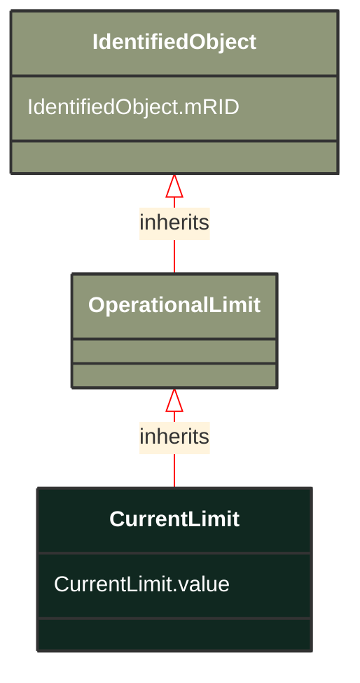

# CurrentLimit

_Operational limit on current._

**URI**: [cim:CurrentLimit](http://iec.ch/TC57/CIM100#CurrentLimit) 
**Type**: Class

## Inheritance
* [IdentifiedObject](/Models/Profiles/SteadyStateHypothesis/ConcreteClasses/IdentifiedObject/)
    * [OperationalLimit](/Models/Profiles/SteadyStateHypothesis/ConcreteClasses/OperationalLimit/)
        * **CurrentLimit**

## Attributes
| Name | URI | Cardinality and Range | Description | Inheritance |
| ---  | --- | --- | --- | --- |
| value | [cim:CurrentLimit.value](http://iec.ch/TC57/CIM100#CurrentLimit.value) | No cardinality available CurrentFlow | Limit on current flow. The attribute shall be a positive value or zero. | direct |
| mRID | [cim:IdentifiedObject.mRID](http://iec.ch/TC57/CIM100#IdentifiedObject.mRID) | No cardinality available string | Master resource identifier issued by a model authority. The mRID is unique within an exchange context. Global uniqueness is easily achieved by using a UUID, as specified in RFC 4122, for the mRID. The use of UUID is strongly recommended.
For CIMXML data files in RDF syntax conforming to IEC 61970-552, the mRID is mapped to rdf:ID or rdf:about attributes that identify CIM object elements. | IdentifiedObject |

### Schema Source
* from schema: [http://iec.ch/TC57/ns/CIM/SteadyStateHypothesis-EUPackage_SteadyStateHypothesisProfile](http://iec.ch/TC57/ns/CIM/SteadyStateHypothesis-EUPackage_SteadyStateHypothesisProfile)
