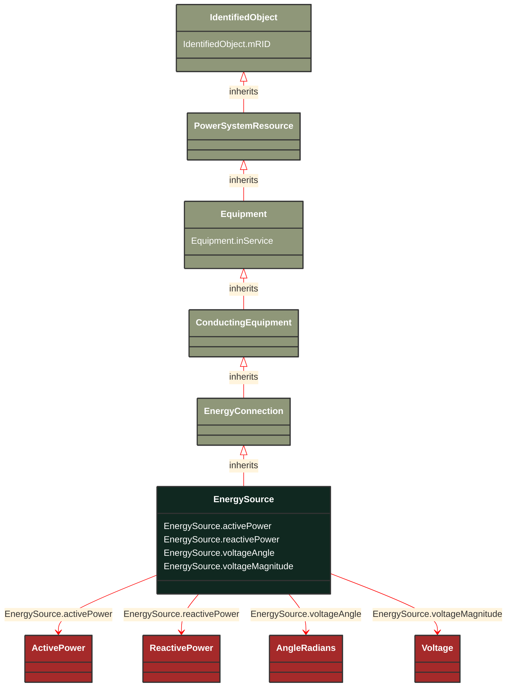

# EnergySource

_A generic equivalent for an energy supplier on a transmission or distribution voltage level._

**URI**: [cim:EnergySource](http://iec.ch/TC57/CIM100#EnergySource) 
**Type**: Class

## Inheritance
* [IdentifiedObject](/Models/Profiles/SteadyStateHypothesis/ConcreteClasses/IdentifiedObject/)
    * [PowerSystemResource](/Models/Profiles/SteadyStateHypothesis/ConcreteClasses/PowerSystemResource/)
        * [Equipment](/Models/Profiles/SteadyStateHypothesis/ConcreteClasses/Equipment/)
            * [ConductingEquipment](/Models/Profiles/SteadyStateHypothesis/ConcreteClasses/ConductingEquipment/)
                * [EnergyConnection](/Models/Profiles/SteadyStateHypothesis/ConcreteClasses/EnergyConnection/)
                    * **EnergySource**

## Attributes
| Name | URI | Cardinality and Range | Description | Inheritance |
| ---  | --- | --- | --- | --- |
| activePower | [cim:EnergySource.activePower](http://iec.ch/TC57/CIM100#EnergySource.activePower) | No cardinality available ActivePower | High voltage source active injection. Load sign convention is used, i.e. positive sign means flow out from a node.
Starting value for steady state solutions. | direct |
| reactivePower | [cim:EnergySource.reactivePower](http://iec.ch/TC57/CIM100#EnergySource.reactivePower) | No cardinality available ReactivePower | High voltage source reactive injection. Load sign convention is used, i.e. positive sign means flow out from a node.
Starting value for steady state solutions. | direct |
| voltageAngle | [cim:EnergySource.voltageAngle](http://iec.ch/TC57/CIM100#EnergySource.voltageAngle) | No cardinality available AngleRadians | Phase angle of a-phase open circuit used when voltage characteristics need to be imposed at the node associated with the terminal of the energy source, such as when voltages and angles from the transmission level are used as input to the distribution network. The attribute shall be a positive value or zero. | direct |
| voltageMagnitude | [cim:EnergySource.voltageMagnitude](http://iec.ch/TC57/CIM100#EnergySource.voltageMagnitude) | No cardinality available Voltage | Phase-to-phase open circuit voltage magnitude used when voltage characteristics need to be imposed at the node associated with the terminal of the energy source, such as when voltages and angles from the transmission level are used as input to the distribution network. The attribute shall be a positive value or zero. | direct |
| inService | [cim:Equipment.inService](http://iec.ch/TC57/CIM100#Equipment.inService) | No cardinality available boolean | Specifies the availability of the equipment. True means the equipment is available for topology processing, which determines if the equipment is energized or not. False means that the equipment is treated by network applications as if it is not in the model. | Equipment |
| mRID | [cim:IdentifiedObject.mRID](http://iec.ch/TC57/CIM100#IdentifiedObject.mRID) | No cardinality available string | Master resource identifier issued by a model authority. The mRID is unique within an exchange context. Global uniqueness is easily achieved by using a UUID, as specified in RFC 4122, for the mRID. The use of UUID is strongly recommended.
For CIMXML data files in RDF syntax conforming to IEC 61970-552, the mRID is mapped to rdf:ID or rdf:about attributes that identify CIM object elements. | IdentifiedObject |

### Schema Source
* from schema: [http://iec.ch/TC57/ns/CIM/SteadyStateHypothesis-EUPackage_SteadyStateHypothesisProfile](http://iec.ch/TC57/ns/CIM/SteadyStateHypothesis-EUPackage_SteadyStateHypothesisProfile)
