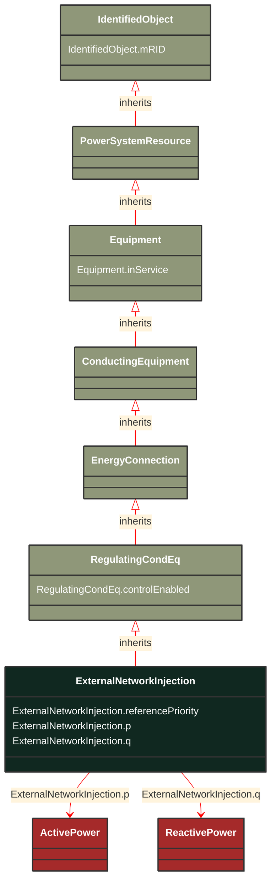

# ExternalNetworkInjection

_This class represents the external network and it is used for IEC 60909 calculations._

**URI**: [cim:ExternalNetworkInjection](http://iec.ch/TC57/CIM100#ExternalNetworkInjection) 
**Type**: Class

## Inheritance
* [IdentifiedObject](/Models/Profiles/SteadyStateHypothesis/ConcreteClasses/IdentifiedObject/)
    * [PowerSystemResource](/Models/Profiles/SteadyStateHypothesis/ConcreteClasses/PowerSystemResource/)
        * [Equipment](/Models/Profiles/SteadyStateHypothesis/ConcreteClasses/Equipment/)
            * [ConductingEquipment](/Models/Profiles/SteadyStateHypothesis/ConcreteClasses/ConductingEquipment/)
                * [EnergyConnection](/Models/Profiles/SteadyStateHypothesis/ConcreteClasses/EnergyConnection/)
                    * [RegulatingCondEq](/Models/Profiles/SteadyStateHypothesis/ConcreteClasses/RegulatingCondEq/)
                        * **ExternalNetworkInjection**

## Attributes
| Name | URI | Cardinality and Range | Description | Inheritance |
| ---  | --- | --- | --- | --- |
| referencePriority | [cim:ExternalNetworkInjection.referencePriority](http://iec.ch/TC57/CIM100#ExternalNetworkInjection.referencePriority) | No cardinality available integer | Priority of unit for use as powerflow voltage phase angle reference bus selection. 0 = don t care (default) 1 = highest priority. 2 is less than 1 and so on. | direct |
| p | [cim:ExternalNetworkInjection.p](http://iec.ch/TC57/CIM100#ExternalNetworkInjection.p) | No cardinality available ActivePower | Active power injection. Load sign convention is used, i.e. positive sign means flow out from a node.
Starting value for steady state solutions. | direct |
| q | [cim:ExternalNetworkInjection.q](http://iec.ch/TC57/CIM100#ExternalNetworkInjection.q) | No cardinality available ReactivePower | Reactive power injection. Load sign convention is used, i.e. positive sign means flow out from a node.
Starting value for steady state solutions. | direct |
| controlEnabled | [cim:RegulatingCondEq.controlEnabled](http://iec.ch/TC57/CIM100#RegulatingCondEq.controlEnabled) | No cardinality available boolean | Specifies the regulation status of the equipment.  True is regulating, false is not regulating. | RegulatingCondEq |
| inService | [cim:Equipment.inService](http://iec.ch/TC57/CIM100#Equipment.inService) | No cardinality available boolean | Specifies the availability of the equipment. True means the equipment is available for topology processing, which determines if the equipment is energized or not. False means that the equipment is treated by network applications as if it is not in the model. | Equipment |
| mRID | [cim:IdentifiedObject.mRID](http://iec.ch/TC57/CIM100#IdentifiedObject.mRID) | No cardinality available string | Master resource identifier issued by a model authority. The mRID is unique within an exchange context. Global uniqueness is easily achieved by using a UUID, as specified in RFC 4122, for the mRID. The use of UUID is strongly recommended.
For CIMXML data files in RDF syntax conforming to IEC 61970-552, the mRID is mapped to rdf:ID or rdf:about attributes that identify CIM object elements. | IdentifiedObject |

### Schema Source
* from schema: [http://iec.ch/TC57/ns/CIM/SteadyStateHypothesis-EUPackage_SteadyStateHypothesisProfile](http://iec.ch/TC57/ns/CIM/SteadyStateHypothesis-EUPackage_SteadyStateHypothesisProfile)
