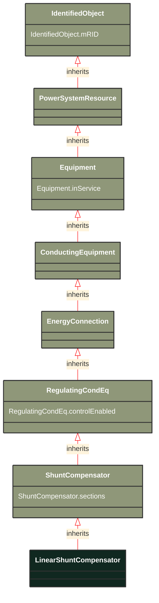

# LinearShuntCompensator

_A linear shunt compensator has banks or sections with equal admittance values._

**URI**: [cim:LinearShuntCompensator](http://iec.ch/TC57/CIM100#LinearShuntCompensator) 
**Type**: Class

## Inheritance
* [IdentifiedObject](/Models/Profiles/SteadyStateHypothesis/ConcreteClasses/IdentifiedObject/)
    * [PowerSystemResource](/Models/Profiles/SteadyStateHypothesis/ConcreteClasses/PowerSystemResource/)
        * [Equipment](/Models/Profiles/SteadyStateHypothesis/ConcreteClasses/Equipment/)
            * [ConductingEquipment](/Models/Profiles/SteadyStateHypothesis/ConcreteClasses/ConductingEquipment/)
                * [EnergyConnection](/Models/Profiles/SteadyStateHypothesis/ConcreteClasses/EnergyConnection/)
                    * [RegulatingCondEq](/Models/Profiles/SteadyStateHypothesis/ConcreteClasses/RegulatingCondEq/)
                        * [ShuntCompensator](/Models/Profiles/SteadyStateHypothesis/ConcreteClasses/ShuntCompensator/)
                            * **LinearShuntCompensator**

## Attributes
| Name | URI | Cardinality and Range | Description | Inheritance |
| ---  | --- | --- | --- | --- |
| sections | [cim:ShuntCompensator.sections](http://iec.ch/TC57/CIM100#ShuntCompensator.sections) | No cardinality available float | Shunt compensator sections in use. Starting value for steady state solution. The attribute shall be a positive value or zero. Non integer values are allowed to support continuous variables. The reasons for continuous value are to support study cases where no discrete shunt compensators has yet been designed, a solutions where a narrow voltage band force the sections to oscillate or accommodate for a continuous solution as input. 
For LinearShuntConpensator the value shall be between zero and ShuntCompensator.maximumSections. At value zero the shunt compensator conductance and admittance is zero. Linear interpolation of conductance and admittance between the previous and next integer section is applied in case of non-integer values.
For NonlinearShuntCompensator-s shall only be set to one of the NonlinearShuntCompenstorPoint.sectionNumber. There is no interpolation between NonlinearShuntCompenstorPoint-s. | ShuntCompensator |
| controlEnabled | [cim:RegulatingCondEq.controlEnabled](http://iec.ch/TC57/CIM100#RegulatingCondEq.controlEnabled) | No cardinality available boolean | Specifies the regulation status of the equipment.  True is regulating, false is not regulating. | RegulatingCondEq |
| inService | [cim:Equipment.inService](http://iec.ch/TC57/CIM100#Equipment.inService) | No cardinality available boolean | Specifies the availability of the equipment. True means the equipment is available for topology processing, which determines if the equipment is energized or not. False means that the equipment is treated by network applications as if it is not in the model. | Equipment |
| mRID | [cim:IdentifiedObject.mRID](http://iec.ch/TC57/CIM100#IdentifiedObject.mRID) | No cardinality available string | Master resource identifier issued by a model authority. The mRID is unique within an exchange context. Global uniqueness is easily achieved by using a UUID, as specified in RFC 4122, for the mRID. The use of UUID is strongly recommended.
For CIMXML data files in RDF syntax conforming to IEC 61970-552, the mRID is mapped to rdf:ID or rdf:about attributes that identify CIM object elements. | IdentifiedObject |

### Schema Source
* from schema: [http://iec.ch/TC57/ns/CIM/SteadyStateHypothesis-EUPackage_SteadyStateHypothesisProfile](http://iec.ch/TC57/ns/CIM/SteadyStateHypothesis-EUPackage_SteadyStateHypothesisProfile)
