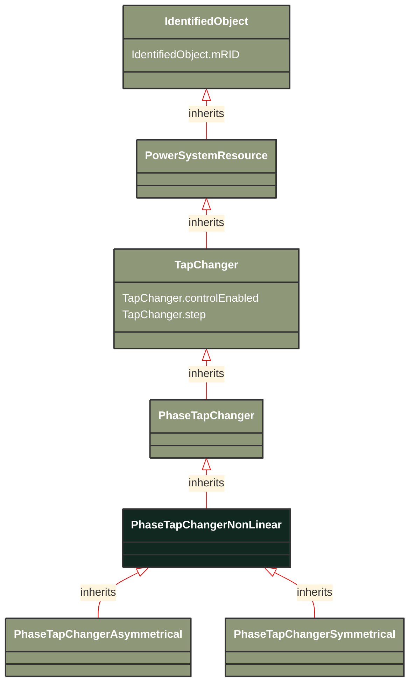

# PhaseTapChangerNonLinear

_The non-linear phase tap changer describes the non-linear behaviour of a phase tap changer. This is a base class for the symmetrical and asymmetrical phase tap changer models. The details of these models can be found in IEC 61970-301._

**URI**: [cim:PhaseTapChangerNonLinear](http://iec.ch/TC57/CIM100#PhaseTapChangerNonLinear) 
**Type**: Class

## Inheritance
* [IdentifiedObject](/Models/Profiles/SteadyStateHypothesis/ConcreteClasses/IdentifiedObject/)
    * [PowerSystemResource](/Models/Profiles/SteadyStateHypothesis/ConcreteClasses/PowerSystemResource/)
        * [TapChanger](/Models/Profiles/SteadyStateHypothesis/ConcreteClasses/TapChanger/)
            * [PhaseTapChanger](/Models/Profiles/SteadyStateHypothesis/ConcreteClasses/PhaseTapChanger/)
                * **PhaseTapChangerNonLinear**

## Attributes
| Name | URI | Cardinality and Range | Description | Inheritance |
| ---  | --- | --- | --- | --- |
| controlEnabled | [cim:TapChanger.controlEnabled](http://iec.ch/TC57/CIM100#TapChanger.controlEnabled) | No cardinality available boolean | Specifies the regulation status of the equipment.  True is regulating, false is not regulating. | TapChanger |
| step | [cim:TapChanger.step](http://iec.ch/TC57/CIM100#TapChanger.step) | No cardinality available float | Tap changer position.
Starting step for a steady state solution. Non integer values are allowed to support continuous tap variables. The reasons for continuous value are to support study cases where no discrete tap changer has yet been designed, a solution where a narrow voltage band forces the tap step to oscillate or to accommodate for a continuous solution as input.
The attribute shall be equal to or greater than lowStep and equal to or less than highStep. | TapChanger |
| mRID | [cim:IdentifiedObject.mRID](http://iec.ch/TC57/CIM100#IdentifiedObject.mRID) | No cardinality available string | Master resource identifier issued by a model authority. The mRID is unique within an exchange context. Global uniqueness is easily achieved by using a UUID, as specified in RFC 4122, for the mRID. The use of UUID is strongly recommended.
For CIMXML data files in RDF syntax conforming to IEC 61970-552, the mRID is mapped to rdf:ID or rdf:about attributes that identify CIM object elements. | IdentifiedObject |

### Schema Source
* from schema: [http://iec.ch/TC57/ns/CIM/SteadyStateHypothesis-EUPackage_SteadyStateHypothesisProfile](http://iec.ch/TC57/ns/CIM/SteadyStateHypothesis-EUPackage_SteadyStateHypothesisProfile)
