# ReactivePower

_Product of RMS value of the voltage and the RMS value of the quadrature component of the current._

**URI**: [cim:ReactivePower](http://iec.ch/TC57/CIM100#ReactivePower) 
**Type**: Class

```mermaid
%%{init: {'theme':'base','themeVariables': {'lineColor': '#FF0000'}}}%%
classDiagram
    class ReactivePower
    click ReactivePower href "/Models/Profiles/SteadyStateHypothesis/ConcreteClasses/ReactivePower/"
    style ReactivePower fill:#102820,stroke:#333,stroke-width:2px,rx:10,ry:10,color:white


        ACDCConverter --> ReactivePower : ACDCConverter.q

        ACDCConverter
            click ACDCConverter href "/Models/Profiles/SteadyStateHypothesis/ConcreteClasses/ACDCConverter/"
            style ACDCConverter fill:#A52A2A,stroke:#333,stroke-width:2px,rx:10,ry:10,color:white

        EnergyConsumer --> ReactivePower : EnergyConsumer.q

        EnergyConsumer
            click EnergyConsumer href "/Models/Profiles/SteadyStateHypothesis/ConcreteClasses/EnergyConsumer/"
            style EnergyConsumer fill:#A52A2A,stroke:#333,stroke-width:2px,rx:10,ry:10,color:white

        EnergySource --> ReactivePower : EnergySource.reactivePower

        EnergySource
            click EnergySource href "/Models/Profiles/SteadyStateHypothesis/ConcreteClasses/EnergySource/"
            style EnergySource fill:#A52A2A,stroke:#333,stroke-width:2px,rx:10,ry:10,color:white

        EquivalentInjection --> ReactivePower : EquivalentInjection.q

        EquivalentInjection
            click EquivalentInjection href "/Models/Profiles/SteadyStateHypothesis/ConcreteClasses/EquivalentInjection/"
            style EquivalentInjection fill:#A52A2A,stroke:#333,stroke-width:2px,rx:10,ry:10,color:white

        ExternalNetworkInjection --> ReactivePower : ExternalNetworkInjection.q

        ExternalNetworkInjection
            click ExternalNetworkInjection href "/Models/Profiles/SteadyStateHypothesis/ConcreteClasses/ExternalNetworkInjection/"
            style ExternalNetworkInjection fill:#A52A2A,stroke:#333,stroke-width:2px,rx:10,ry:10,color:white

        PowerElectronicsConnection --> ReactivePower : PowerElectronicsConnection.q

        PowerElectronicsConnection
            click PowerElectronicsConnection href "/Models/Profiles/SteadyStateHypothesis/ConcreteClasses/PowerElectronicsConnection/"
            style PowerElectronicsConnection fill:#A52A2A,stroke:#333,stroke-width:2px,rx:10,ry:10,color:white

        RotatingMachine --> ReactivePower : RotatingMachine.q

        RotatingMachine
            click RotatingMachine href "/Models/Profiles/SteadyStateHypothesis/ConcreteClasses/RotatingMachine/"
            style RotatingMachine fill:#A52A2A,stroke:#333,stroke-width:2px,rx:10,ry:10,color:white

        StaticVarCompensator --> ReactivePower : StaticVarCompensator.q

        StaticVarCompensator
            click StaticVarCompensator href "/Models/Profiles/SteadyStateHypothesis/ConcreteClasses/StaticVarCompensator/"
            style StaticVarCompensator fill:#A52A2A,stroke:#333,stroke-width:2px,rx:10,ry:10,color:white

        VsConverter --> ReactivePower : VsConverter.targetQpcc

        VsConverter
            click VsConverter href "/Models/Profiles/SteadyStateHypothesis/ConcreteClasses/VsConverter/"
            style VsConverter fill:#A52A2A,stroke:#333,stroke-width:2px,rx:10,ry:10,color:white

        ReactivePower --> UnitSymbol : ReactivePower.unit

        UnitSymbol
            click UnitSymbol href "/Models/Profiles/SteadyStateHypothesis/Enumerations/UnitSymbol/"
            style UnitSymbol fill:#4D2D18,stroke:#333,stroke-width:2px,rx:10,ry:10,color:white
        ReactivePower --> UnitMultiplier : ReactivePower.multiplier

        UnitMultiplier
            click UnitMultiplier href "/Models/Profiles/SteadyStateHypothesis/Enumerations/UnitMultiplier/"
            style UnitMultiplier fill:#4D2D18,stroke:#333,stroke-width:2px,rx:10,ry:10,color:white

        ReactivePower : ReactivePower.value
        ReactivePower : ReactivePower.unit
        ReactivePower : ReactivePower.multiplier
```

## Inheritance
* **ReactivePower**

## Attributes
| Name | URI | Cardinality and Range | Description | Inheritance |
| ---  | --- | --- | --- | --- |
| value | [cim:ReactivePower.value](http://iec.ch/TC57/CIM100#ReactivePower.value) | No cardinality available float | No description available | direct |
| unit | [cim:ReactivePower.unit](http://iec.ch/TC57/CIM100#ReactivePower.unit) | No cardinality available UnitSymbol | No description available | direct |
| multiplier | [cim:ReactivePower.multiplier](http://iec.ch/TC57/CIM100#ReactivePower.multiplier) | No cardinality available UnitMultiplier | No description available | direct |

### Schema Source
* from schema: [http://iec.ch/TC57/ns/CIM/SteadyStateHypothesis-EUPackage_SteadyStateHypothesisProfile](http://iec.ch/TC57/ns/CIM/SteadyStateHypothesis-EUPackage_SteadyStateHypothesisProfile)
