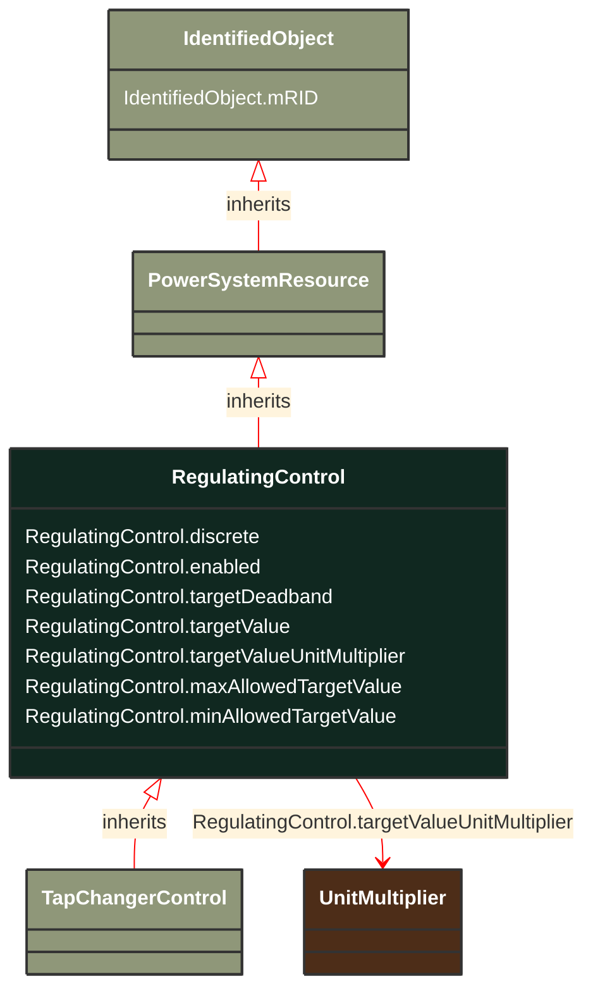

# RegulatingControl

_Specifies a set of equipment that works together to control a power system quantity such as voltage or flow. 
Remote bus voltage control is possible by specifying the controlled terminal located at some place remote from the controlling equipment.
The specified terminal shall be associated with the connectivity node of the controlled point.  The most specific subtype of RegulatingControl shall be used in case such equipment participate in the control, e.g. TapChangerControl for tap changers.
For flow control, load sign convention is used, i.e. positive sign means flow out from a TopologicalNode (bus) into the conducting equipment.
The attribute minAllowedTargetValue and maxAllowedTargetValue are required in the following cases:
- For a power generating module operated in power factor control mode to specify maximum and minimum power factor values;
- Whenever it is necessary to have an off center target voltage for the tap changer regulator. For instance, due to long cables to off shore wind farms and the need to have a simpler setup at the off shore transformer platform, the voltage is controlled from the land at the connection point for the off shore wind farm. Since there usually is a voltage rise along the cable, there is typical and overvoltage of up 3-4 kV compared to the on shore station. Thus in normal operation the tap changer on the on shore station is operated with a target set point, which is in the lower parts of the dead band.
The attributes minAllowedTargetValue and maxAllowedTargetValue are not related to the attribute targetDeadband and thus they are not treated as an alternative of the targetDeadband. They are needed due to limitations in the local substation controller. The attribute targetDeadband is used to prevent the power flow from move the tap position in circles (hunting) that is to be used regardless of the attributes minAllowedTargetValue and maxAllowedTargetValue._

**URI**: [cim:RegulatingControl](http://iec.ch/TC57/CIM100#RegulatingControl) 
**Type**: Class

## Inheritance
* [IdentifiedObject](/Models/Profiles/SteadyStateHypothesis/ConcreteClasses/IdentifiedObject/)
    * [PowerSystemResource](/Models/Profiles/SteadyStateHypothesis/ConcreteClasses/PowerSystemResource/)
        * **RegulatingControl**

## Attributes
| Name | URI | Cardinality and Range | Description | Inheritance |
| ---  | --- | --- | --- | --- |
| discrete | [cim:RegulatingControl.discrete](http://iec.ch/TC57/CIM100#RegulatingControl.discrete) | No cardinality available boolean | The regulation is performed in a discrete mode. This applies to equipment with discrete controls, e.g. tap changers and shunt compensators. | direct |
| enabled | [cim:RegulatingControl.enabled](http://iec.ch/TC57/CIM100#RegulatingControl.enabled) | No cardinality available boolean | The flag tells if regulation is enabled. | direct |
| targetDeadband | [cim:RegulatingControl.targetDeadband](http://iec.ch/TC57/CIM100#RegulatingControl.targetDeadband) | No cardinality available float | This is a deadband used with discrete control to avoid excessive update of controls like tap changers and shunt compensator banks while regulating.  The units of those appropriate for the mode. The attribute shall be a positive value or zero. If RegulatingControl.discrete is set to "false", the RegulatingControl.targetDeadband is to be ignored.
Note that for instance, if the targetValue is 100 kV and the targetDeadband is 2 kV the range is from 99 to 101 kV. | direct |
| targetValue | [cim:RegulatingControl.targetValue](http://iec.ch/TC57/CIM100#RegulatingControl.targetValue) | No cardinality available float | The target value specified for case input.   This value can be used for the target value without the use of schedules. The value has the units appropriate to the mode attribute. | direct |
| targetValueUnitMultiplier | [cim:RegulatingControl.targetValueUnitMultiplier](http://iec.ch/TC57/CIM100#RegulatingControl.targetValueUnitMultiplier) | No cardinality available UnitMultiplier | Specify the multiplier for used for the targetValue. | direct |
| maxAllowedTargetValue | [cim:RegulatingControl.maxAllowedTargetValue](http://iec.ch/TC57/CIM100#RegulatingControl.maxAllowedTargetValue) | No cardinality available float | Maximum allowed target value (RegulatingControl.targetValue). | direct |
| minAllowedTargetValue | [cim:RegulatingControl.minAllowedTargetValue](http://iec.ch/TC57/CIM100#RegulatingControl.minAllowedTargetValue) | No cardinality available float | Minimum allowed target value (RegulatingControl.targetValue). | direct |
| mRID | [cim:IdentifiedObject.mRID](http://iec.ch/TC57/CIM100#IdentifiedObject.mRID) | No cardinality available string | Master resource identifier issued by a model authority. The mRID is unique within an exchange context. Global uniqueness is easily achieved by using a UUID, as specified in RFC 4122, for the mRID. The use of UUID is strongly recommended.
For CIMXML data files in RDF syntax conforming to IEC 61970-552, the mRID is mapped to rdf:ID or rdf:about attributes that identify CIM object elements. | IdentifiedObject |

### Schema Source
* from schema: [http://iec.ch/TC57/ns/CIM/SteadyStateHypothesis-EUPackage_SteadyStateHypothesisProfile](http://iec.ch/TC57/ns/CIM/SteadyStateHypothesis-EUPackage_SteadyStateHypothesisProfile)
