# VsConverter

_DC side of the voltage source converter (VSC)._

**URI**: [cim:VsConverter](http://iec.ch/TC57/CIM100#VsConverter) 
**Type**: Class

```mermaid
%%{init: {'theme':'base','themeVariables': {'lineColor': '#FF0000'}}}%%
classDiagram
    class VsConverter
    click VsConverter href "/Models/Profiles/SteadyStateHypothesis/ConcreteClasses/VsConverter/"
    style VsConverter fill:#102820,stroke:#333,stroke-width:2px,rx:10,ry:10,color:white
     
        ACDCConverter <|-- VsConverter : inherits
            click ACDCConverter href "/Models/Profiles/SteadyStateHypothesis/ConcreteClasses/ACDCConverter/"
            style ACDCConverter fill:#8F9779,stroke:#333,stroke-width:2px,rx:10,ry:10,color:white
     
        ConductingEquipment <|-- ACDCConverter : inherits
            click ConductingEquipment href "/Models/Profiles/SteadyStateHypothesis/ConcreteClasses/ConductingEquipment/"
            style ConductingEquipment fill:#8F9779,stroke:#333,stroke-width:2px,rx:10,ry:10,color:white
     
        Equipment <|-- ConductingEquipment : inherits
            click Equipment href "/Models/Profiles/SteadyStateHypothesis/ConcreteClasses/Equipment/"
            style Equipment fill:#8F9779,stroke:#333,stroke-width:2px,rx:10,ry:10,color:white
     
        PowerSystemResource <|-- Equipment : inherits
            click PowerSystemResource href "/Models/Profiles/SteadyStateHypothesis/ConcreteClasses/PowerSystemResource/"
            style PowerSystemResource fill:#8F9779,stroke:#333,stroke-width:2px,rx:10,ry:10,color:white
     
        IdentifiedObject <|-- PowerSystemResource : inherits
            click IdentifiedObject href "/Models/Profiles/SteadyStateHypothesis/ConcreteClasses/IdentifiedObject/"
            style IdentifiedObject fill:#8F9779,stroke:#333,stroke-width:2px,rx:10,ry:10,color:white


        VsConverter --> VsPpccControlKind : VsConverter.pPccControl

        VsPpccControlKind
            click VsPpccControlKind href "/Models/Profiles/SteadyStateHypothesis/Enumerations/VsPpccControlKind/"
            style VsPpccControlKind fill:#4D2D18,stroke:#333,stroke-width:2px,rx:10,ry:10,color:white
        VsConverter --> VsQpccControlKind : VsConverter.qPccControl

        VsQpccControlKind
            click VsQpccControlKind href "/Models/Profiles/SteadyStateHypothesis/Enumerations/VsQpccControlKind/"
            style VsQpccControlKind fill:#4D2D18,stroke:#333,stroke-width:2px,rx:10,ry:10,color:white

        VsConverter : VsConverter.droop
        VsConverter : VsConverter.droopCompensation
        VsConverter : VsConverter.pPccControl
        VsConverter : VsConverter.qPccControl
        VsConverter : VsConverter.qShare
        VsConverter : VsConverter.targetQpcc
        VsConverter : VsConverter.targetUpcc
        VsConverter : VsConverter.targetPowerFactorPcc
        VsConverter : VsConverter.targetPhasePcc
        VsConverter : VsConverter.targetPWMfactor
        ACDCConverter : ACDCConverter.p
        ACDCConverter : ACDCConverter.q
        ACDCConverter : ACDCConverter.targetPpcc
        ACDCConverter : ACDCConverter.targetUdc
        Equipment : Equipment.inService
        IdentifiedObject : IdentifiedObject.mRID
```

## Inheritance
* [IdentifiedObject](/Models/Profiles/SteadyStateHypothesis/ConcreteClasses/IdentifiedObject/)
    * [PowerSystemResource](/Models/Profiles/SteadyStateHypothesis/ConcreteClasses/PowerSystemResource/)
        * [Equipment](/Models/Profiles/SteadyStateHypothesis/ConcreteClasses/Equipment/)
            * [ConductingEquipment](/Models/Profiles/SteadyStateHypothesis/ConcreteClasses/ConductingEquipment/)
                * [ACDCConverter](/Models/Profiles/SteadyStateHypothesis/ConcreteClasses/ACDCConverter/)
                    * **VsConverter**

## Attributes
| Name | URI | Cardinality and Range | Description | Inheritance |
| ---  | --- | --- | --- | --- |
| droop | [cim:VsConverter.droop](http://iec.ch/TC57/CIM100#VsConverter.droop) | No cardinality available PU | Droop constant. The pu value is obtained as D [kV/MW] x Sb / Ubdc. The attribute shall be a positive value. | direct |
| droopCompensation | [cim:VsConverter.droopCompensation](http://iec.ch/TC57/CIM100#VsConverter.droopCompensation) | No cardinality available Resistance | Compensation constant. Used to compensate for voltage drop when controlling voltage at a distant bus. The attribute shall be a positive value. | direct |
| pPccControl | [cim:VsConverter.pPccControl](http://iec.ch/TC57/CIM100#VsConverter.pPccControl) | No cardinality available VsPpccControlKind | Kind of control of real power and/or DC voltage. | direct |
| qPccControl | [cim:VsConverter.qPccControl](http://iec.ch/TC57/CIM100#VsConverter.qPccControl) | No cardinality available VsQpccControlKind | Kind of reactive power control. | direct |
| qShare | [cim:VsConverter.qShare](http://iec.ch/TC57/CIM100#VsConverter.qShare) | No cardinality available PerCent | Reactive power sharing factor among parallel converters on Uac control. The attribute shall be a positive value or zero. | direct |
| targetQpcc | [cim:VsConverter.targetQpcc](http://iec.ch/TC57/CIM100#VsConverter.targetQpcc) | No cardinality available ReactivePower | Reactive power injection target in AC grid, at point of common coupling.  Load sign convention is used, i.e. positive sign means flow out from a node. | direct |
| targetUpcc | [cim:VsConverter.targetUpcc](http://iec.ch/TC57/CIM100#VsConverter.targetUpcc) | No cardinality available Voltage | Voltage target in AC grid, at point of common coupling. The attribute shall be a positive value. | direct |
| targetPowerFactorPcc | [cim:VsConverter.targetPowerFactorPcc](http://iec.ch/TC57/CIM100#VsConverter.targetPowerFactorPcc) | No cardinality available float | Power factor target at the AC side, at point of common coupling. The attribute shall be a positive value. | direct |
| targetPhasePcc | [cim:VsConverter.targetPhasePcc](http://iec.ch/TC57/CIM100#VsConverter.targetPhasePcc) | No cardinality available AngleDegrees | Phase target at AC side, at point of common coupling. The attribute shall be a positive value. | direct |
| targetPWMfactor | [cim:VsConverter.targetPWMfactor](http://iec.ch/TC57/CIM100#VsConverter.targetPWMfactor) | No cardinality available float | Magnitude of pulse-modulation factor. The attribute shall be a positive value. | direct |
| p | [cim:ACDCConverter.p](http://iec.ch/TC57/CIM100#ACDCConverter.p) | No cardinality available ActivePower | Active power at the point of common coupling. Load sign convention is used, i.e. positive sign means flow out from a node.
Starting value for a steady state solution in the case a simplified power flow model is used. | ACDCConverter |
| q | [cim:ACDCConverter.q](http://iec.ch/TC57/CIM100#ACDCConverter.q) | No cardinality available ReactivePower | Reactive power at the point of common coupling. Load sign convention is used, i.e. positive sign means flow out from a node.
Starting value for a steady state solution in the case a simplified power flow model is used. | ACDCConverter |
| targetPpcc | [cim:ACDCConverter.targetPpcc](http://iec.ch/TC57/CIM100#ACDCConverter.targetPpcc) | No cardinality available ActivePower | Real power injection target in AC grid, at point of common coupling.  Load sign convention is used, i.e. positive sign means flow out from a node. | ACDCConverter |
| targetUdc | [cim:ACDCConverter.targetUdc](http://iec.ch/TC57/CIM100#ACDCConverter.targetUdc) | No cardinality available Voltage | Target value for DC voltage magnitude. The attribute shall be a positive value. | ACDCConverter |
| inService | [cim:Equipment.inService](http://iec.ch/TC57/CIM100#Equipment.inService) | No cardinality available boolean | Specifies the availability of the equipment. True means the equipment is available for topology processing, which determines if the equipment is energized or not. False means that the equipment is treated by network applications as if it is not in the model. | Equipment |
| mRID | [cim:IdentifiedObject.mRID](http://iec.ch/TC57/CIM100#IdentifiedObject.mRID) | No cardinality available string | Master resource identifier issued by a model authority. The mRID is unique within an exchange context. Global uniqueness is easily achieved by using a UUID, as specified in RFC 4122, for the mRID. The use of UUID is strongly recommended.
For CIMXML data files in RDF syntax conforming to IEC 61970-552, the mRID is mapped to rdf:ID or rdf:about attributes that identify CIM object elements. | IdentifiedObject |

### Schema Source
* from schema: [http://iec.ch/TC57/ns/CIM/SteadyStateHypothesis-EUPackage_SteadyStateHypothesisProfile](http://iec.ch/TC57/ns/CIM/SteadyStateHypothesis-EUPackage_SteadyStateHypothesisProfile)
