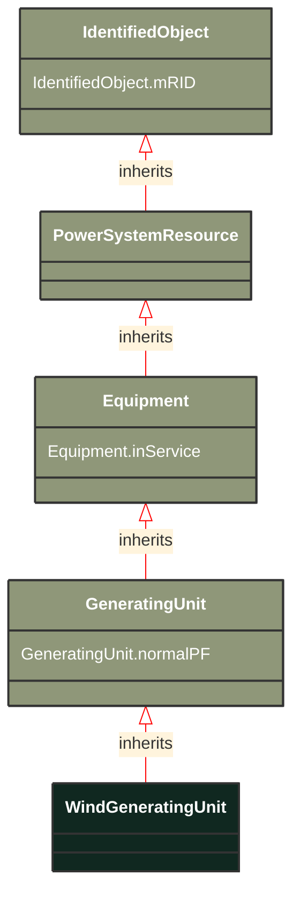

# WindGeneratingUnit

_A wind driven generating unit, connected to the grid by means of a rotating machine.  May be used to represent a single turbine or an aggregation._

**URI**: [cim:WindGeneratingUnit](http://iec.ch/TC57/CIM100#WindGeneratingUnit) 
**Type**: Class

## Inheritance
* [IdentifiedObject](/Models/Profiles/SteadyStateHypothesis/ConcreteClasses/IdentifiedObject/)
    * [PowerSystemResource](/Models/Profiles/SteadyStateHypothesis/ConcreteClasses/PowerSystemResource/)
        * [Equipment](/Models/Profiles/SteadyStateHypothesis/ConcreteClasses/Equipment/)
            * [GeneratingUnit](/Models/Profiles/SteadyStateHypothesis/ConcreteClasses/GeneratingUnit/)
                * **WindGeneratingUnit**

## Attributes
| Name | URI | Cardinality and Range | Description | Inheritance |
| ---  | --- | --- | --- | --- |
| normalPF | [cim:GeneratingUnit.normalPF](http://iec.ch/TC57/CIM100#GeneratingUnit.normalPF) | No cardinality available float | Generating unit economic participation factor.  The sum of the participation factors across generating units does not have to sum to one.  It is used for representing distributed slack participation factor. The attribute shall be a positive value or zero. | GeneratingUnit |
| inService | [cim:Equipment.inService](http://iec.ch/TC57/CIM100#Equipment.inService) | No cardinality available boolean | Specifies the availability of the equipment. True means the equipment is available for topology processing, which determines if the equipment is energized or not. False means that the equipment is treated by network applications as if it is not in the model. | Equipment |
| mRID | [cim:IdentifiedObject.mRID](http://iec.ch/TC57/CIM100#IdentifiedObject.mRID) | No cardinality available string | Master resource identifier issued by a model authority. The mRID is unique within an exchange context. Global uniqueness is easily achieved by using a UUID, as specified in RFC 4122, for the mRID. The use of UUID is strongly recommended.
For CIMXML data files in RDF syntax conforming to IEC 61970-552, the mRID is mapped to rdf:ID or rdf:about attributes that identify CIM object elements. | IdentifiedObject |

### Schema Source
* from schema: [http://iec.ch/TC57/ns/CIM/SteadyStateHypothesis-EUPackage_SteadyStateHypothesisProfile](http://iec.ch/TC57/ns/CIM/SteadyStateHypothesis-EUPackage_SteadyStateHypothesisProfile)
