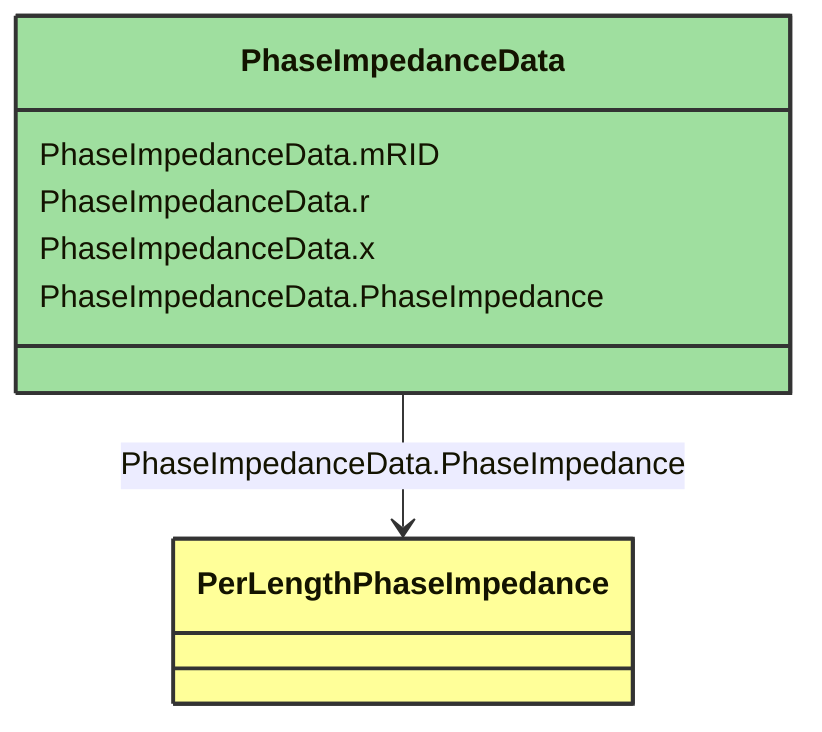

# PhaseImpedanceData

_Impedance and conductance matrix element values.The diagonal elements are described by the elements having the same toPhase and fromPhase value and the off diagonal elements have different toPhase and fromPhase values.  The matrix can also be stored in symmetric lower triangular format using the row and column attributes, which map to ACLineSegmentPhase.sequenceNumber._

**URI**: [cim:PhaseImpedanceData](http://iec.ch/TC57/CIM-generic#PhaseImpedanceData) 
**Type**: Class

## Inheritance
* **PhaseImpedanceData**

## Attributes
| Name | URI | Cardinality and Range | Description | Inheritance |
| ---  | --- | --- | --- | --- |
| mRID | [cim:PhaseImpedanceData.mRID](http://iec.ch/TC57/CIM-generic#PhaseImpedanceData.mRID) | 0..1 string | Master resource identifier issued by a model authority. The mRID is unique within an exchange context. Global uniqueness is easily achieved by using a UUID, as specified in IETF RFC 4122, for the mRID. The use of UUID is strongly recommended.For CIMXML data files in RDF syntax conforming to IEC 61970-552, the mRID is mapped to rdf:ID or rdf:about attributes that identify CIM object elements. | direct |
| r | [cim:PhaseImpedanceData.r](http://iec.ch/TC57/CIM-generic#PhaseImpedanceData.r) | 0..1 ResistancePerLength | Resistance matrix element value, per length of unit. | direct |
| x | [cim:PhaseImpedanceData.x](http://iec.ch/TC57/CIM-generic#PhaseImpedanceData.x) | 0..1 ReactancePerLength | Reactance matrix element value, per length of unit. | direct |
| PhaseImpedance | [cim:PhaseImpedanceData.PhaseImpedance](http://iec.ch/TC57/CIM-generic#PhaseImpedanceData.PhaseImpedance) | 0..1 PerLengthPhaseImpedance | Conductor phase impedance to which this data belongs. | direct |

### Schema Source
* from schema: [http://iec.ch/TC57/2007/profile](http://iec.ch/TC57/2007/profile)
