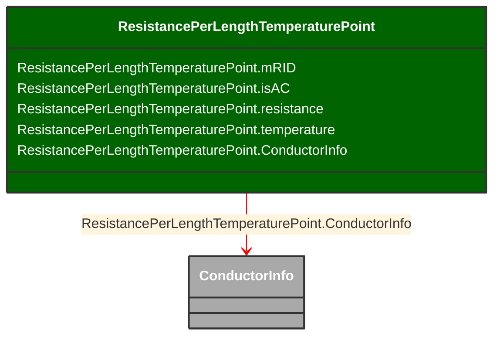

# ResistancePerLengthTemperaturePoint

_No description available_

**URI**: [cim:ResistancePerLengthTemperaturePoint](http://iec.ch/TC57/CIM-generic#ResistancePerLengthTemperaturePoint) 
**Type**: Class

## Inheritance
* **ResistancePerLengthTemperaturePoint**

## Attributes
| Name | URI | Cardinality and Range | Description | Inheritance |
| ---  | --- | --- | --- | --- |
| mRID | [cim:ResistancePerLengthTemperaturePoint.mRID](http://iec.ch/TC57/CIM-generic#ResistancePerLengthTemperaturePoint.mRID) | 0..1 string | Master resource identifier issued by a model authority. The mRID is unique within an exchange context. Global uniqueness is easily achieved by using a UUID, as specified in IETF RFC 4122, for the mRID. The use of UUID is strongly recommended.For CIMXML data files in RDF syntax conforming to IEC 61970-552, the mRID is mapped to rdf:ID or rdf:about attributes that identify CIM object elements. | direct |
| isAC | [cim:ResistancePerLengthTemperaturePoint.isAC](http://iec.ch/TC57/CIM-generic#ResistancePerLengthTemperaturePoint.isAC) | 0..1 boolean | No description available | direct |
| resistance | [cim:ResistancePerLengthTemperaturePoint.resistance](http://iec.ch/TC57/CIM-generic#ResistancePerLengthTemperaturePoint.resistance) | 0..1 ResistancePerLength | No description available | direct |
| temperature | [cim:ResistancePerLengthTemperaturePoint.temperature](http://iec.ch/TC57/CIM-generic#ResistancePerLengthTemperaturePoint.temperature) | 0..1 Temperature | No description available | direct |
| ConductorInfo | [cim:ResistancePerLengthTemperaturePoint.ConductorInfo](http://iec.ch/TC57/CIM-generic#ResistancePerLengthTemperaturePoint.ConductorInfo) | 0..1 ConductorInfo | Conductor with this (resistance, temperature) pair. | direct |

### Schema Source
* from schema: [http://iec.ch/TC57/2007/profile](http://iec.ch/TC57/2007/profile)
