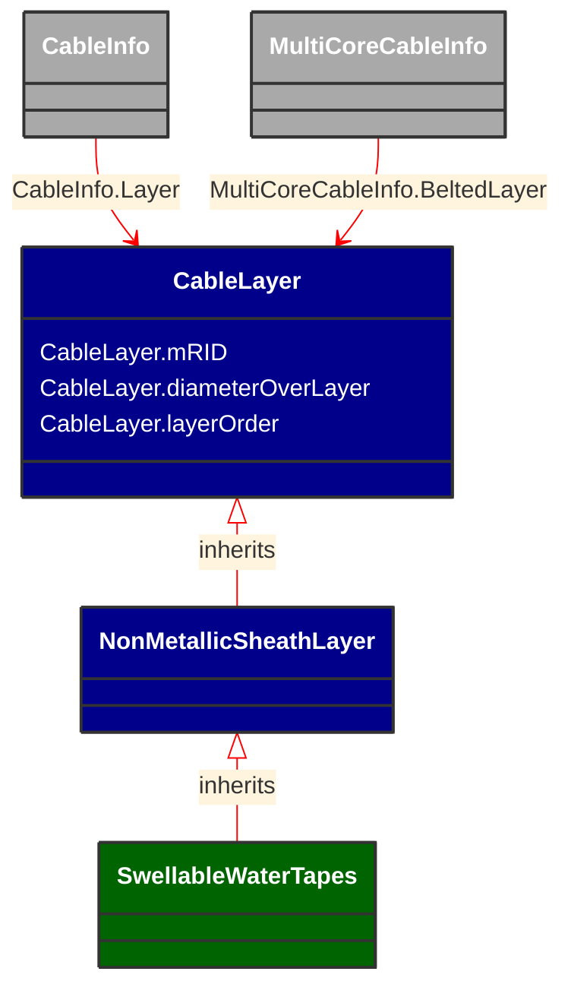

# SwellableWaterTapes

_Swellable water tapes (SWTPs) to provide longitudinal and radial water blocking. It can be made of a semi-conducting or a non-conductive material (NCWST).Typically applied between the insulation screen and the shield layers and/or over the shield layer and/or over the shield layer.Note that the Shield and Armor layers may also have a water blocking purpose. In such cases MettalicSheath should be used instead._

**URI**: [cim:SwellableWaterTapes](http://iec.ch/TC57/CIM-generic#SwellableWaterTapes) 
**Type**: Class

## Inheritance
* [CableLayer](CableLayer.md)
    * [NonMetallicSheathLayer](NonMetallicSheathLayer.md)
        * **SwellableWaterTapes**

## Attributes
| Name | URI | Cardinality and Range | Description | Inheritance |
| ---  | --- | --- | --- | --- |
| mRID | [cim:CableLayer.mRID](http://iec.ch/TC57/CIM-generic#CableLayer.mRID) | 0..1 string | Master resource identifier issued by a model authority. The mRID is unique within an exchange context. Global uniqueness is easily achieved by using a UUID, as specified in IETF RFC 4122, for the mRID. The use of UUID is strongly recommended.For CIMXML data files in RDF syntax conforming to IEC 61970-552, the mRID is mapped to rdf:ID or rdf:about attributes that identify CIM object elements. | CableLayer |
| diameterOverLayer | [cim:CableLayer.diameterOverLayer](http://iec.ch/TC57/CIM-generic#CableLayer.diameterOverLayer) | 0..1 Length | Use either diameter over layer or layer thickness.Specification varies by manufacturer and manufacturing process. For extruded layers, the diameter is typically provided. For tapes, the thickness is typically applied. | CableLayer |
| layerOrder | [cim:CableLayer.layerOrder](http://iec.ch/TC57/CIM-generic#CableLayer.layerOrder) | 0..1 integer | Order of the layer outwards from the cable core.For a multi-core cable, belted layers must have their own order starting from the first belted layer.Intercalated layers (typically tapes, where each tape is both below and above the other tape) must share the same layer order. | CableLayer |

### Schema Source
* from schema: [http://iec.ch/TC57/2007/profile](http://iec.ch/TC57/2007/profile)
