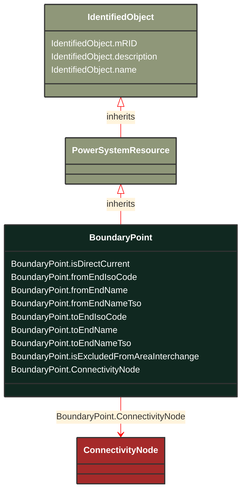

# BoundaryPoint

_Represents a boundary point in the power system._

**URI**: [eu:BoundaryPoint](https://cim.ucaiug.io/ns/eu#BoundaryPoint) 
**Type**: Class

## Inheritance
* [IdentifiedObject](/Models/Profiles/Telemark-120BoundaryModel/AbstractClasses/IdentifiedObject/)
    * [PowerSystemResource](/Models/Profiles/Telemark-120BoundaryModel/AbstractClasses/PowerSystemResource/)
        * **BoundaryPoint**

## Attributes
| Name | URI | Cardinality and Range | Description | Inheritance |
| ---  | --- | --- | --- | --- |
| isDirectCurrent | [eu:BoundaryPoint.isDirectCurrent](https://cim.ucaiug.io/ns/eu#BoundaryPoint.isDirectCurrent) | 0..1 boolean | Indicates whether the terminal is direct current. | direct |
| fromEndIsoCode | [eu:BoundaryPoint.fromEndIsoCode](https://cim.ucaiug.io/ns/eu#BoundaryPoint.fromEndIsoCode) | 0..1 string | ISO code representing the starting point of the boundary. | direct |
| fromEndName | [eu:BoundaryPoint.fromEndName](https://cim.ucaiug.io/ns/eu#BoundaryPoint.fromEndName) | 0..1 string | Name representing the starting point of the boundary. | direct |
| fromEndNameTso | [eu:BoundaryPoint.fromEndNameTso](https://cim.ucaiug.io/ns/eu#BoundaryPoint.fromEndNameTso) | 0..1 string | Name of the Transmission System Operator (TSO) at the starting point of the boundary. | direct |
| toEndIsoCode | [eu:BoundaryPoint.toEndIsoCode](https://cim.ucaiug.io/ns/eu#BoundaryPoint.toEndIsoCode) | 0..1 string | ISO code representing the ending point of the boundary. | direct |
| toEndName | [eu:BoundaryPoint.toEndName](https://cim.ucaiug.io/ns/eu#BoundaryPoint.toEndName) | 0..1 string | Name representing the ending point of the boundary. | direct |
| toEndNameTso | [eu:BoundaryPoint.toEndNameTso](https://cim.ucaiug.io/ns/eu#BoundaryPoint.toEndNameTso) | 0..1 string | Name of the Transmission System Operator (TSO) at the ending point of the boundary. | direct |
| isExcludedFromAreaInterchange | [eu:BoundaryPoint.isExcludedFromAreaInterchange](https://cim.ucaiug.io/ns/eu#BoundaryPoint.isExcludedFromAreaInterchange) | 0..1 boolean | Indicates whether the boundary point is excluded from area interchange calculations. | direct |
| ConnectivityNode | [eu:BoundaryPoint.ConnectivityNode](https://cim.ucaiug.io/ns/eu#BoundaryPoint.ConnectivityNode) | 0..1 ConnectivityNode | Represents the connectivity node associated with the boundary point. | direct |
| mRID | [cim:IdentifiedObject.mRID](https://cim.ucaiug.io/ns#IdentifiedObject.mRID) | 0..1 string | Master resource identifier issued by a model authority. The mRID is unique within an exchange context. Global uniqueness is easily achieved by using a UUID, as specified in RFC 4122, for the mRID. The use of UUID is strongly recommended.For CIMXML data files in RDF syntax conforming to IEC 61970-552, the mRID is mapped to rdf:ID or rdf:about attributes that identify CIM object elements. | IdentifiedObject |
| description | [cim:IdentifiedObject.description](https://cim.ucaiug.io/ns#IdentifiedObject.description) | 0..1 string | The description is a free human readable text describing or naming the object. It may be non unique and may not correlate to a naming hierarchy. | IdentifiedObject |
| name | [cim:IdentifiedObject.name](https://cim.ucaiug.io/ns#IdentifiedObject.name) | 0..1 string | The name is any free human readable and possibly non unique text naming the object. | IdentifiedObject |

### Schema Source
* from schema: [https://ap-no.cim4.eu/BoundaryModel/1.0](https://ap-no.cim4.eu/BoundaryModel/1.0)
