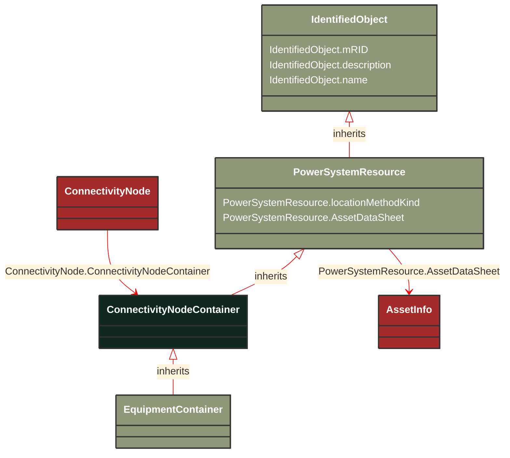

# ConnectivityNodeContainer

_A base class for all objects that may contain connectivity nodes or topological nodes._

*__NOTE__: this is an abstract class and should not be instantiated directly

**URI**: [cim:ConnectivityNodeContainer](https://cim.ucaiug.io/ns#ConnectivityNodeContainer) 
**Type**: Class

## Inheritance
* [IdentifiedObject](/Models/Profiles/Telemark-120Equipment/AbstractClasses/IdentifiedObject/)
    * [PowerSystemResource](/Models/Profiles/Telemark-120Equipment/AbstractClasses/PowerSystemResource/)
        * **ConnectivityNodeContainer**

## Attributes
| Name | URI | Cardinality and Range | Description | Inheritance |
| ---  | --- | --- | --- | --- |
| locationMethodKind | [nc-no:PowerSystemResource.locationMethodKind](http://cim4.eu/ns/nc-no#PowerSystemResource.locationMethodKind) | 0..1 LocationMethodKind | Possible methods to derive geographical location. | PowerSystemResource |
| AssetDataSheet | [cim:PowerSystemResource.AssetDataSheet](https://cim.ucaiug.io/ns#PowerSystemResource.AssetDataSheet) | 0..1 AssetInfo | Datasheet information for this power system resource. | PowerSystemResource |
| mRID | [cim:IdentifiedObject.mRID](https://cim.ucaiug.io/ns#IdentifiedObject.mRID) | 0..1 string | Master resource identifier issued by a model authority. The mRID is unique within an exchange context. Global uniqueness is easily achieved by using a UUID, as specified in RFC 4122, for the mRID. The use of UUID is strongly recommended.For CIMXML data files in RDF syntax conforming to IEC 61970-552, the mRID is mapped to rdf:ID or rdf:about attributes that identify CIM object elements. | IdentifiedObject |
| description | [cim:IdentifiedObject.description](https://cim.ucaiug.io/ns#IdentifiedObject.description) | 0..1 string | The description is a free human readable text describing or naming the object. It may be non unique and may not correlate to a naming hierarchy. | IdentifiedObject |
| name | [cim:IdentifiedObject.name](https://cim.ucaiug.io/ns#IdentifiedObject.name) | 0..1 string | The name is any free human readable and possibly non unique text naming the object. | IdentifiedObject |

### Schema Source
* from schema: [https://ap-no.cim4.eu/Equipment/1.0](https://ap-no.cim4.eu/Equipment/1.0)
