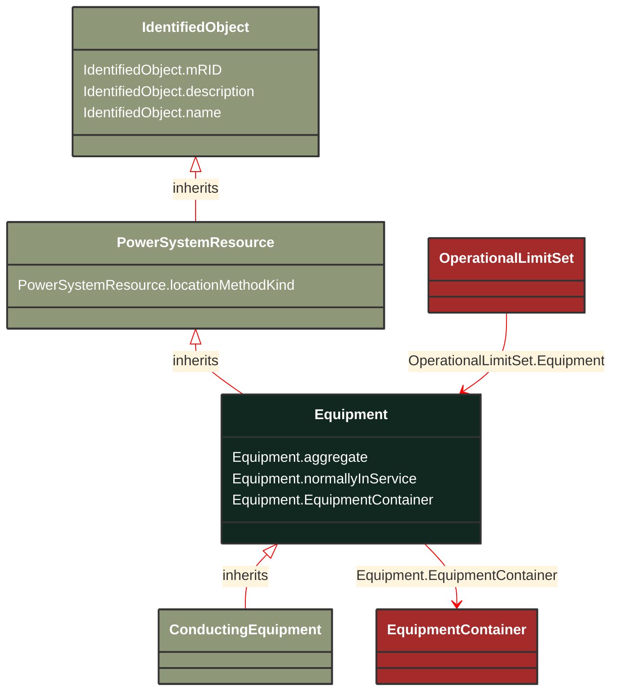

# Equipment

_The parts of a power system that are physical devices, electronic or mechanical._

*__NOTE__: this is an abstract class and should not be instantiated directly

**URI**: [cim:Equipment](https://cim.ucaiug.io/ns#Equipment) 
**Type**: Class

## Inheritance
* [IdentifiedObject](/Models/Profiles/Telemark-120Equipment/AbstractClasses/IdentifiedObject/)
    * [PowerSystemResource](/Models/Profiles/Telemark-120Equipment/AbstractClasses/PowerSystemResource/)
        * **Equipment**

## Attributes
| Name | URI | Cardinality and Range | Description | Inheritance |
| ---  | --- | --- | --- | --- |
| aggregate | [cim:Equipment.aggregate](https://cim.ucaiug.io/ns#Equipment.aggregate) | 0..1 boolean | The aggregate attribute is used to indicate that the object is an aggregate of other objects. The aggregate attribute is used to indicate that the object is an aggregate of other objects. The aggregate attribute is used to indicate that the object is an aggregate of other objects. | direct |
| normallyInService | [cim:Equipment.normallyInService](https://cim.ucaiug.io/ns#Equipment.normallyInService) | 0..1 boolean | The normallyInService attribute is used to indicate that the object is normally in service. The normallyInService attribute is used to indicate that the object is normally in service. The normallyInService attribute is used to indicate that the object is normally in service. | direct |
| EquipmentContainer | [cim:Equipment.EquipmentContainer](https://cim.ucaiug.io/ns#Equipment.EquipmentContainer) | 0..1 EquipmentContainer | Container of this equipment. | direct |
| locationMethodKind | [nc-no:PowerSystemResource.locationMethodKind](http://cim4.eu/ns/nc-no#PowerSystemResource.locationMethodKind) | 0..1 LocationMethodKind | Possible methods to derive geographical location. | PowerSystemResource |
| mRID | [cim:IdentifiedObject.mRID](https://cim.ucaiug.io/ns#IdentifiedObject.mRID) | 0..1 string | Master resource identifier issued by a model authority. The mRID is unique within an exchange context. Global uniqueness is easily achieved by using a UUID, as specified in RFC 4122, for the mRID. The use of UUID is strongly recommended.For CIMXML data files in RDF syntax conforming to IEC 61970-552, the mRID is mapped to rdf:ID or rdf:about attributes that identify CIM object elements. | IdentifiedObject |
| description | [cim:IdentifiedObject.description](https://cim.ucaiug.io/ns#IdentifiedObject.description) | 0..1 string | The description is a free human readable text describing or naming the object. It may be non unique and may not correlate to a naming hierarchy. | IdentifiedObject |
| name | [cim:IdentifiedObject.name](https://cim.ucaiug.io/ns#IdentifiedObject.name) | 0..1 string | The name is any free human readable and possibly non unique text naming the object. | IdentifiedObject |

### Schema Source
* from schema: [https://ap-no.cim4.eu/Equipment/1.0](https://ap-no.cim4.eu/Equipment/1.0)
