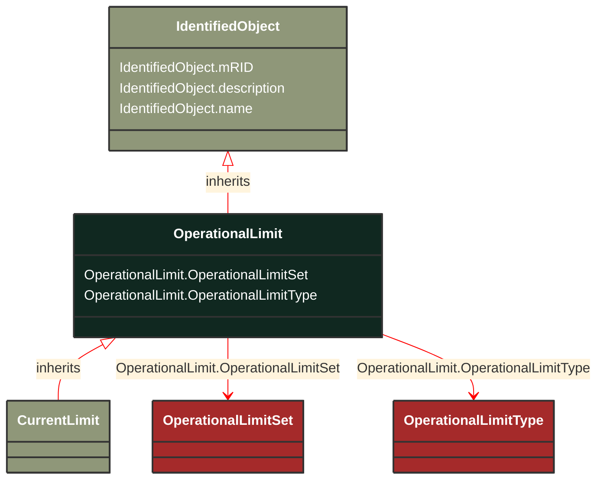

# OperationalLimit

_A value and normal value associated with a specific kind of limit.The sub class value and normalValue attributes vary inversely to the associated OperationalLimitType.acceptableDuration (acceptableDuration for short).If a particular piece of equipment has multiple operational limits of the same kind (apparent power, current, etc.), the limit with the greatest acceptableDuration shall have the smallest limit value and the limit with the smallest acceptableDuration shall have the largest limit value.  Note: A large current can only be allowed to flow through a piece of equipment for a short duration without causing damage, but a lesser current can be allowed to flow for a longer duration._

*__NOTE__: this is an abstract class and should not be instantiated directly

**URI**: [cim:OperationalLimit](https://cim.ucaiug.io/ns#OperationalLimit) 
**Type**: Class

## Inheritance
* [IdentifiedObject](IdentifiedObject.md)
    * **OperationalLimit**

## Attributes
| Name | URI | Cardinality and Range | Description | Inheritance |
| ---  | --- | --- | --- | --- |
| OperationalLimitSet | [cim:OperationalLimit.OperationalLimitSet](https://cim.ucaiug.io/ns#OperationalLimit.OperationalLimitSet) | 0..1 OperationalLimitSet | The limit set to which the limit values belong. | direct |
| OperationalLimitType | [cim:OperationalLimit.OperationalLimitType](https://cim.ucaiug.io/ns#OperationalLimit.OperationalLimitType) | 0..1 OperationalLimitType | The limit type associated with this limit. | direct |
| mRID | [cim:IdentifiedObject.mRID](https://cim.ucaiug.io/ns#IdentifiedObject.mRID) | 0..1 string | Master resource identifier issued by a model authority. The mRID is unique within an exchange context. Global uniqueness is easily achieved by using a UUID, as specified in RFC 4122, for the mRID. The use of UUID is strongly recommended.For CIMXML data files in RDF syntax conforming to IEC 61970-552, the mRID is mapped to rdf:ID or rdf:about attributes that identify CIM object elements. | IdentifiedObject |
| description | [cim:IdentifiedObject.description](https://cim.ucaiug.io/ns#IdentifiedObject.description) | 0..1 string | The description is a free human readable text describing or naming the object. It may be non unique and may not correlate to a naming hierarchy. | IdentifiedObject |
| name | [cim:IdentifiedObject.name](https://cim.ucaiug.io/ns#IdentifiedObject.name) | 0..1 string | The name is any free human readable and possibly non unique text naming the object. | IdentifiedObject |

### Schema Source
* from schema: [https://ap-no.cim4.eu/Equipment/1.0](https://ap-no.cim4.eu/Equipment/1.0)
