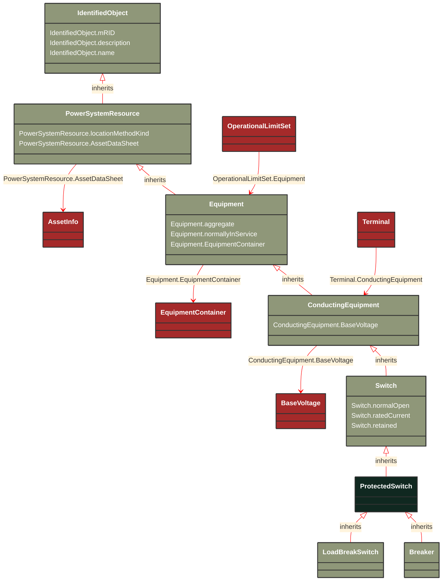

# ProtectedSwitch

_A ProtectedSwitch is a switching device that can be operated by ProtectionEquipment._

*__NOTE__: this is an abstract class and should not be instantiated directly

**URI**: [cim:ProtectedSwitch](https://cim.ucaiug.io/ns#ProtectedSwitch) 
**Type**: Class

## Inheritance
* [IdentifiedObject](/Models/Profiles/Telemark-120Equipment/AbstractClasses/IdentifiedObject/)
    * [PowerSystemResource](/Models/Profiles/Telemark-120Equipment/AbstractClasses/PowerSystemResource/)
        * [Equipment](/Models/Profiles/Telemark-120Equipment/AbstractClasses/Equipment/)
            * [ConductingEquipment](/Models/Profiles/Telemark-120Equipment/AbstractClasses/ConductingEquipment/)
                * [Switch](/Models/Profiles/Telemark-120Equipment/ConcreteClasses/Switch/)
                    * **ProtectedSwitch**

## Attributes
| Name | URI | Cardinality and Range | Description | Inheritance |
| ---  | --- | --- | --- | --- |
| normalOpen | [cim:Switch.normalOpen](https://cim.ucaiug.io/ns#Switch.normalOpen) | 0..1 boolean | The attribute is used in cases when no Measurement for the status value is present. If the Switch has a status measurement the Discrete.normalValue is expected to match with the Switch.normalOpen. | Switch |
| ratedCurrent | [cim:Switch.ratedCurrent](https://cim.ucaiug.io/ns#Switch.ratedCurrent) | 0..1 CurrentFlow | The maximum continuous current carrying capacity in amps governed by the device material and construction.The attribute shall be a positive value. | Switch |
| retained | [cim:Switch.retained](https://cim.ucaiug.io/ns#Switch.retained) | 0..1 boolean | Branch is retained in the topological solution.  The flow through retained switches will normally be calculated in power flow. | Switch |
| BaseVoltage | [cim:ConductingEquipment.BaseVoltage](https://cim.ucaiug.io/ns#ConductingEquipment.BaseVoltage) | 0..1 BaseVoltage | Base voltage of this conducting equipment.  Use only when there is no voltage level container used and only one base voltage applies.  For example, not used for transformers. | ConductingEquipment |
| aggregate | [cim:Equipment.aggregate](https://cim.ucaiug.io/ns#Equipment.aggregate) | 0..1 boolean | The aggregate attribute is used to indicate that the object is an aggregate of other objects. The aggregate attribute is used to indicate that the object is an aggregate of other objects. The aggregate attribute is used to indicate that the object is an aggregate of other objects. | Equipment |
| normallyInService | [cim:Equipment.normallyInService](https://cim.ucaiug.io/ns#Equipment.normallyInService) | 0..1 boolean | The normallyInService attribute is used to indicate that the object is normally in service. The normallyInService attribute is used to indicate that the object is normally in service. The normallyInService attribute is used to indicate that the object is normally in service. | Equipment |
| EquipmentContainer | [cim:Equipment.EquipmentContainer](https://cim.ucaiug.io/ns#Equipment.EquipmentContainer) | 0..1 EquipmentContainer | Container of this equipment. | Equipment |
| locationMethodKind | [nc-no:PowerSystemResource.locationMethodKind](http://cim4.eu/ns/nc-no#PowerSystemResource.locationMethodKind) | 0..1 LocationMethodKind | Possible methods to derive geographical location. | PowerSystemResource |
| AssetDataSheet | [cim:PowerSystemResource.AssetDataSheet](https://cim.ucaiug.io/ns#PowerSystemResource.AssetDataSheet) | 0..1 AssetInfo | Datasheet information for this power system resource. | PowerSystemResource |
| mRID | [cim:IdentifiedObject.mRID](https://cim.ucaiug.io/ns#IdentifiedObject.mRID) | 0..1 string | Master resource identifier issued by a model authority. The mRID is unique within an exchange context. Global uniqueness is easily achieved by using a UUID, as specified in RFC 4122, for the mRID. The use of UUID is strongly recommended.For CIMXML data files in RDF syntax conforming to IEC 61970-552, the mRID is mapped to rdf:ID or rdf:about attributes that identify CIM object elements. | IdentifiedObject |
| description | [cim:IdentifiedObject.description](https://cim.ucaiug.io/ns#IdentifiedObject.description) | 0..1 string | The description is a free human readable text describing or naming the object. It may be non unique and may not correlate to a naming hierarchy. | IdentifiedObject |
| name | [cim:IdentifiedObject.name](https://cim.ucaiug.io/ns#IdentifiedObject.name) | 0..1 string | The name is any free human readable and possibly non unique text naming the object. | IdentifiedObject |

### Schema Source
* from schema: [https://ap-no.cim4.eu/Equipment/1.0](https://ap-no.cim4.eu/Equipment/1.0)
