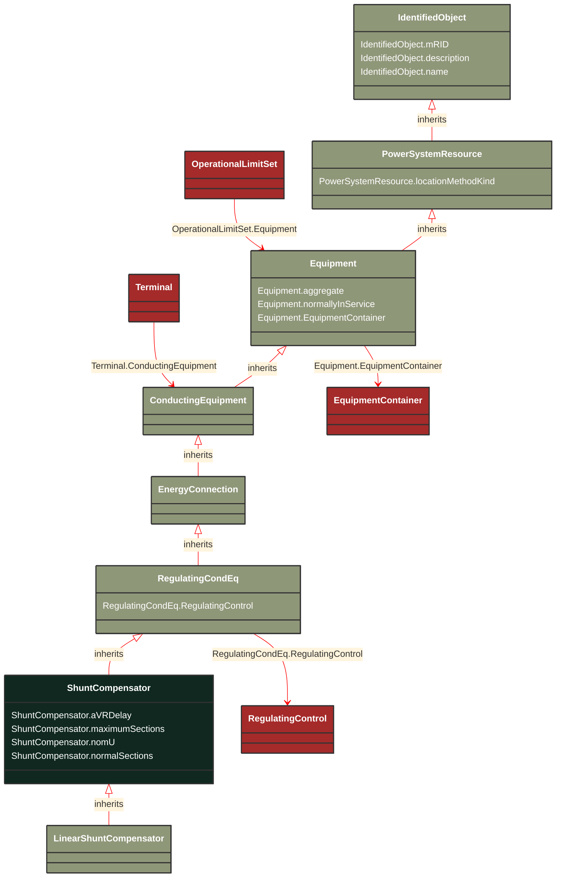

# ShuntCompensator

_A shunt capacitor or reactor or switchable bank of shunt capacitors or reactors. A section of a shunt compensator is an individual capacitor or reactor. A negative value for bPerSection indicates that the compensator is a reactor. ShuntCompensator is a single terminal device.  Ground is implied._

*__NOTE__: this is an abstract class and should not be instantiated directly

**URI**: [cim:ShuntCompensator](https://cim.ucaiug.io/ns#ShuntCompensator) 
**Type**: Class

## Inheritance
* [IdentifiedObject](IdentifiedObject.md)
    * [PowerSystemResource](PowerSystemResource.md)
        * [Equipment](Equipment.md)
            * [ConductingEquipment](ConductingEquipment.md)
                * [EnergyConnection](EnergyConnection.md)
                    * [RegulatingCondEq](RegulatingCondEq.md)
                        * **ShuntCompensator**

## Attributes
| Name | URI | Cardinality and Range | Description | Inheritance |
| ---  | --- | --- | --- | --- |
| aVRDelay | [cim:ShuntCompensator.aVRDelay](https://cim.ucaiug.io/ns#ShuntCompensator.aVRDelay) | 0..1 Seconds | An automatic voltage regulation delay (AVRDelay) which is the time delay from a change in voltage to when the capacitor is allowed to change state. This filters out temporary changes in voltage. | direct |
| maximumSections | [cim:ShuntCompensator.maximumSections](https://cim.ucaiug.io/ns#ShuntCompensator.maximumSections) | 0..1 integer | The maximum number of sections that may be switched in. | direct |
| nomU | [cim:ShuntCompensator.nomU](https://cim.ucaiug.io/ns#ShuntCompensator.nomU) | 0..1 Voltage | The voltage at which the nominal reactive power may be calculated. This should normally be within 10% of the voltage at which the capacitor is connected to the network. | direct |
| normalSections | [cim:ShuntCompensator.normalSections](https://cim.ucaiug.io/ns#ShuntCompensator.normalSections) | 1..1 integer | The normal number of sections switched in. The value shall be between zero and ShuntCompensator.maximumSections. | direct |
| RegulatingControl | [cim:RegulatingCondEq.RegulatingControl](https://cim.ucaiug.io/ns#RegulatingCondEq.RegulatingControl) | 0..1 RegulatingControl | The regulating control scheme in which this equipment participates. | RegulatingCondEq |
| aggregate | [cim:Equipment.aggregate](https://cim.ucaiug.io/ns#Equipment.aggregate) | 0..1 boolean | The aggregate attribute is used to indicate that the object is an aggregate of other objects. The aggregate attribute is used to indicate that the object is an aggregate of other objects. The aggregate attribute is used to indicate that the object is an aggregate of other objects. | Equipment |
| normallyInService | [cim:Equipment.normallyInService](https://cim.ucaiug.io/ns#Equipment.normallyInService) | 0..1 boolean | The normallyInService attribute is used to indicate that the object is normally in service. The normallyInService attribute is used to indicate that the object is normally in service. The normallyInService attribute is used to indicate that the object is normally in service. | Equipment |
| EquipmentContainer | [cim:Equipment.EquipmentContainer](https://cim.ucaiug.io/ns#Equipment.EquipmentContainer) | 0..1 EquipmentContainer | Container of this equipment. | Equipment |
| locationMethodKind | [nc-no:PowerSystemResource.locationMethodKind](http://cim4.eu/ns/nc-no#PowerSystemResource.locationMethodKind) | 0..1 LocationMethodKind | Possible methods to derive geographical location. | PowerSystemResource |
| mRID | [cim:IdentifiedObject.mRID](https://cim.ucaiug.io/ns#IdentifiedObject.mRID) | 0..1 string | Master resource identifier issued by a model authority. The mRID is unique within an exchange context. Global uniqueness is easily achieved by using a UUID, as specified in RFC 4122, for the mRID. The use of UUID is strongly recommended.For CIMXML data files in RDF syntax conforming to IEC 61970-552, the mRID is mapped to rdf:ID or rdf:about attributes that identify CIM object elements. | IdentifiedObject |
| description | [cim:IdentifiedObject.description](https://cim.ucaiug.io/ns#IdentifiedObject.description) | 0..1 string | The description is a free human readable text describing or naming the object. It may be non unique and may not correlate to a naming hierarchy. | IdentifiedObject |
| name | [cim:IdentifiedObject.name](https://cim.ucaiug.io/ns#IdentifiedObject.name) | 0..1 string | The name is any free human readable and possibly non unique text naming the object. | IdentifiedObject |

### Schema Source
* from schema: [https://ap-no.cim4.eu/Equipment/1.0](https://ap-no.cim4.eu/Equipment/1.0)
