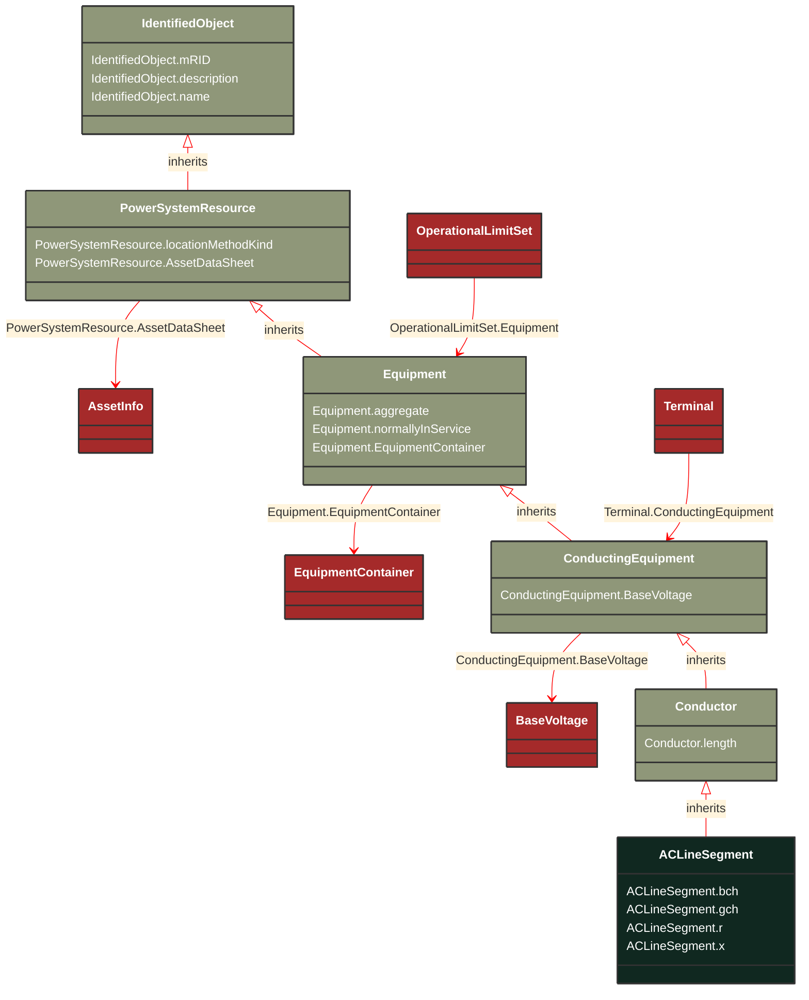

# ACLineSegment

_A wire or combination of wires, with consistent electrical characteristics, building a single electrical system, used to carry alternating current between points in the power system.For symmetrical, transposed three phase lines, it is sufficient to use attributes of the line segment, which describe impedances and admittances for the entire length of the segment.  Additionally impedances can be computed by using length and associated per length impedances.The BaseVoltage at the two ends of ACLineSegments in a Line shall have the same BaseVoltage.nominalVoltage. However, boundary lines may have slightly different BaseVoltage.nominalVoltages and variation is allowed. Larger voltage difference in general requires use of an equivalent branch._

**URI**: [cim:ACLineSegment](https://cim.ucaiug.io/ns#ACLineSegment) 
**Type**: Class

## Inheritance
* [IdentifiedObject](/Models/Profiles/Telemark-120Equipment/AbstractClasses/IdentifiedObject/)
    * [PowerSystemResource](/Models/Profiles/Telemark-120Equipment/AbstractClasses/PowerSystemResource/)
        * [Equipment](/Models/Profiles/Telemark-120Equipment/AbstractClasses/Equipment/)
            * [ConductingEquipment](/Models/Profiles/Telemark-120Equipment/AbstractClasses/ConductingEquipment/)
                * [Conductor](/Models/Profiles/Telemark-120Equipment/AbstractClasses/Conductor/)
                    * **ACLineSegment**

## Attributes
| Name | URI | Cardinality and Range | Description | Inheritance |
| ---  | --- | --- | --- | --- |
| bch | [cim:ACLineSegment.bch](https://cim.ucaiug.io/ns#ACLineSegment.bch) | 0..1 Susceptance | Positive sequence shunt (charging) susceptance, uniformly distributed, of the entire line section.  This value represents the full charging over the full length of the line. | direct |
| gch | [cim:ACLineSegment.gch](https://cim.ucaiug.io/ns#ACLineSegment.gch) | 0..1 Conductance | Positive sequence shunt (charging) conductance, uniformly distributed, of the entire line section. | direct |
| r | [cim:ACLineSegment.r](https://cim.ucaiug.io/ns#ACLineSegment.r) | 0..1 Resistance | Positive sequence series resistance of the entire line section. | direct |
| x | [cim:ACLineSegment.x](https://cim.ucaiug.io/ns#ACLineSegment.x) | 0..1 Reactance | Positive sequence series reactance of the entire line section. | direct |
| length | [cim:Conductor.length](https://cim.ucaiug.io/ns#Conductor.length) | 0..1 Length | Segment length for calculating line section capabilities. | Conductor |
| BaseVoltage | [cim:ConductingEquipment.BaseVoltage](https://cim.ucaiug.io/ns#ConductingEquipment.BaseVoltage) | 0..1 BaseVoltage | Base voltage of this conducting equipment.  Use only when there is no voltage level container used and only one base voltage applies.  For example, not used for transformers. | ConductingEquipment |
| aggregate | [cim:Equipment.aggregate](https://cim.ucaiug.io/ns#Equipment.aggregate) | 0..1 boolean | The aggregate attribute is used to indicate that the object is an aggregate of other objects. The aggregate attribute is used to indicate that the object is an aggregate of other objects. The aggregate attribute is used to indicate that the object is an aggregate of other objects. | Equipment |
| normallyInService | [cim:Equipment.normallyInService](https://cim.ucaiug.io/ns#Equipment.normallyInService) | 0..1 boolean | The normallyInService attribute is used to indicate that the object is normally in service. The normallyInService attribute is used to indicate that the object is normally in service. The normallyInService attribute is used to indicate that the object is normally in service. | Equipment |
| EquipmentContainer | [cim:Equipment.EquipmentContainer](https://cim.ucaiug.io/ns#Equipment.EquipmentContainer) | 0..1 EquipmentContainer | Container of this equipment. | Equipment |
| locationMethodKind | [nc-no:PowerSystemResource.locationMethodKind](http://cim4.eu/ns/nc-no#PowerSystemResource.locationMethodKind) | 0..1 LocationMethodKind | Possible methods to derive geographical location. | PowerSystemResource |
| AssetDataSheet | [cim:PowerSystemResource.AssetDataSheet](https://cim.ucaiug.io/ns#PowerSystemResource.AssetDataSheet) | 0..1 AssetInfo | Datasheet information for this power system resource. | PowerSystemResource |
| mRID | [cim:IdentifiedObject.mRID](https://cim.ucaiug.io/ns#IdentifiedObject.mRID) | 0..1 string | Master resource identifier issued by a model authority. The mRID is unique within an exchange context. Global uniqueness is easily achieved by using a UUID, as specified in RFC 4122, for the mRID. The use of UUID is strongly recommended.For CIMXML data files in RDF syntax conforming to IEC 61970-552, the mRID is mapped to rdf:ID or rdf:about attributes that identify CIM object elements. | IdentifiedObject |
| description | [cim:IdentifiedObject.description](https://cim.ucaiug.io/ns#IdentifiedObject.description) | 0..1 string | The description is a free human readable text describing or naming the object. It may be non unique and may not correlate to a naming hierarchy. | IdentifiedObject |
| name | [cim:IdentifiedObject.name](https://cim.ucaiug.io/ns#IdentifiedObject.name) | 0..1 string | The name is any free human readable and possibly non unique text naming the object. | IdentifiedObject |

### Schema Source
* from schema: [https://ap-no.cim4.eu/Equipment/1.0](https://ap-no.cim4.eu/Equipment/1.0)
