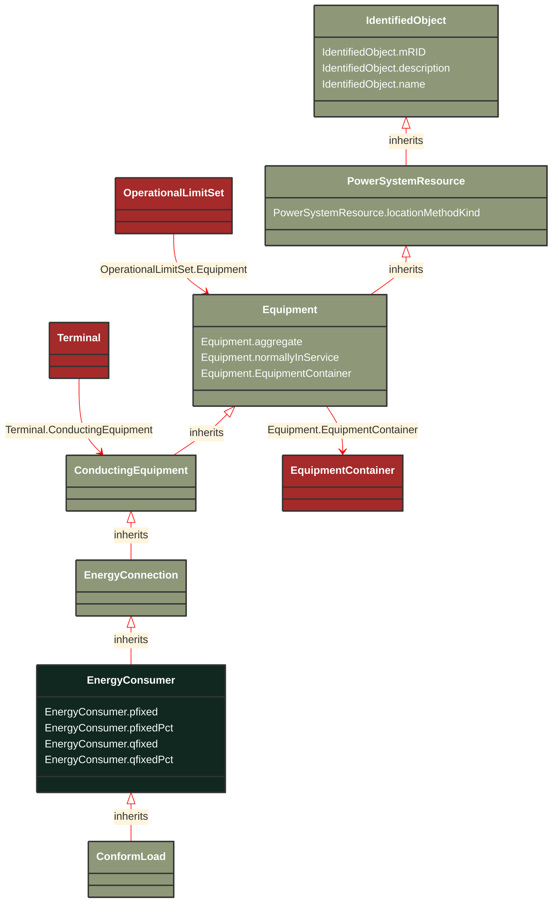

# EnergyConsumer

_Generic user of energy - a  point of consumption on the power system model.EnergyConsumer.pfixed, .qfixed, .pfixedPct and .qfixedPct have meaning only if there is no LoadResponseCharacteristic associated with EnergyConsumer or if LoadResponseCharacteristic.exponentModel is set to False._

**URI**: [cim:EnergyConsumer](https://cim.ucaiug.io/ns#EnergyConsumer) 
**Type**: Class

## Inheritance
* [IdentifiedObject](/Models/Profiles/Telemark-120Equipment/AbstractClasses/IdentifiedObject/)
    * [PowerSystemResource](/Models/Profiles/Telemark-120Equipment/AbstractClasses/PowerSystemResource/)
        * [Equipment](/Models/Profiles/Telemark-120Equipment/AbstractClasses/Equipment/)
            * [ConductingEquipment](/Models/Profiles/Telemark-120Equipment/AbstractClasses/ConductingEquipment/)
                * [EnergyConnection](/Models/Profiles/Telemark-120Equipment/AbstractClasses/EnergyConnection/)
                    * **EnergyConsumer**

## Attributes
| Name | URI | Cardinality and Range | Description | Inheritance |
| ---  | --- | --- | --- | --- |
| pfixed | [cim:EnergyConsumer.pfixed](https://cim.ucaiug.io/ns#EnergyConsumer.pfixed) | 0..1 ActivePower | Active power of the load that is a fixed quantity and does not vary as load group value varies. Load sign convention is used, i.e. positive sign means flow out from a node. | direct |
| pfixedPct | [cim:EnergyConsumer.pfixedPct](https://cim.ucaiug.io/ns#EnergyConsumer.pfixedPct) | 0..1 PerCent | Fixed active power as a percentage of load group fixed active power. Used to represent the time-varying components.  Load sign convention is used, i.e. positive sign means flow out from a node. | direct |
| qfixed | [cim:EnergyConsumer.qfixed](https://cim.ucaiug.io/ns#EnergyConsumer.qfixed) | 0..1 ReactivePower | Reactive power of the load that is a fixed quantity and does not vary as load group value varies. Load sign convention is used, i.e. positive sign means flow out from a node. | direct |
| qfixedPct | [cim:EnergyConsumer.qfixedPct](https://cim.ucaiug.io/ns#EnergyConsumer.qfixedPct) | 0..1 PerCent | Fixed reactive power as a percentage of load group fixed reactive power. Used to represent the time-varying components.  Load sign convention is used, i.e. positive sign means flow out from a node. | direct |
| aggregate | [cim:Equipment.aggregate](https://cim.ucaiug.io/ns#Equipment.aggregate) | 0..1 boolean | The aggregate attribute is used to indicate that the object is an aggregate of other objects. The aggregate attribute is used to indicate that the object is an aggregate of other objects. The aggregate attribute is used to indicate that the object is an aggregate of other objects. | Equipment |
| normallyInService | [cim:Equipment.normallyInService](https://cim.ucaiug.io/ns#Equipment.normallyInService) | 0..1 boolean | The normallyInService attribute is used to indicate that the object is normally in service. The normallyInService attribute is used to indicate that the object is normally in service. The normallyInService attribute is used to indicate that the object is normally in service. | Equipment |
| EquipmentContainer | [cim:Equipment.EquipmentContainer](https://cim.ucaiug.io/ns#Equipment.EquipmentContainer) | 0..1 EquipmentContainer | Container of this equipment. | Equipment |
| locationMethodKind | [nc-no:PowerSystemResource.locationMethodKind](http://cim4.eu/ns/nc-no#PowerSystemResource.locationMethodKind) | 0..1 LocationMethodKind | Possible methods to derive geographical location. | PowerSystemResource |
| mRID | [cim:IdentifiedObject.mRID](https://cim.ucaiug.io/ns#IdentifiedObject.mRID) | 0..1 string | Master resource identifier issued by a model authority. The mRID is unique within an exchange context. Global uniqueness is easily achieved by using a UUID, as specified in RFC 4122, for the mRID. The use of UUID is strongly recommended.For CIMXML data files in RDF syntax conforming to IEC 61970-552, the mRID is mapped to rdf:ID or rdf:about attributes that identify CIM object elements. | IdentifiedObject |
| description | [cim:IdentifiedObject.description](https://cim.ucaiug.io/ns#IdentifiedObject.description) | 0..1 string | The description is a free human readable text describing or naming the object. It may be non unique and may not correlate to a naming hierarchy. | IdentifiedObject |
| name | [cim:IdentifiedObject.name](https://cim.ucaiug.io/ns#IdentifiedObject.name) | 0..1 string | The name is any free human readable and possibly non unique text naming the object. | IdentifiedObject |

### Schema Source
* from schema: [https://ap-no.cim4.eu/Equipment/1.0](https://ap-no.cim4.eu/Equipment/1.0)
