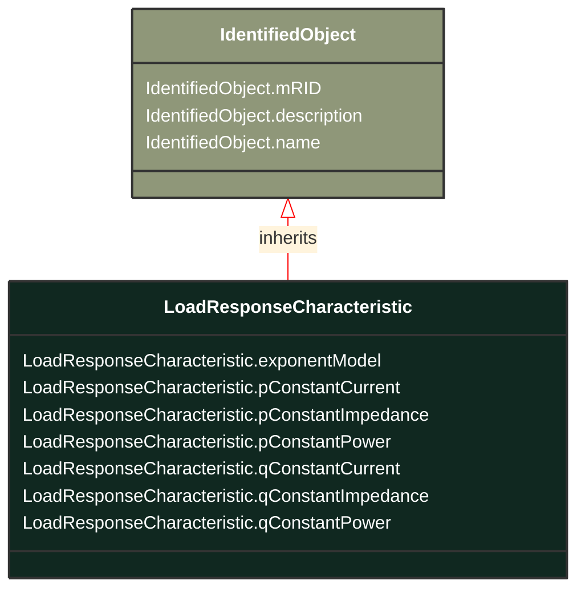

# LoadResponseCharacteristic

_Models the characteristic response of the load demand due to changes in system conditions such as voltage and frequency. It is not related to demand response.If LoadResponseCharacteristic.exponentModel is True, the exponential voltage or frequency dependent models are specified and used as to calculate active and reactive power components of the load model.The equations to calculate active and reactive power components of the load model are internal to the power flow calculation, hence they use different quantities depending on the use case of the data exchange.The equations for exponential voltage dependent load model injected power are:pInjection= Pnominal* (Voltage/cim:BaseVoltage.nominalVoltage) ** cim:LoadResponseCharacteristic.pVoltageExponentqInjection= Qnominal* (Voltage/cim:BaseVoltage.nominalVoltage) ** cim:LoadResponseCharacteristic.qVoltageExponentWhere:1) * means multiply and ** is raised to power of;2) Pnominal and Qnominal represent the active power and reactive power at nominal voltage as any load described by the voltage exponential model shall be given at nominal voltage.  This means that EnergyConsumer.p and EnergyConsumer.q  are at nominal voltage.3) After power flow is solved:-pInjection and qInjection correspond to SvPowerflow.p and SvPowerflow.q respectively.- Voltage corresponds to SvVoltage.v at the TopologicalNode where the load is connected._

**URI**: [cim:LoadResponseCharacteristic](https://cim.ucaiug.io/ns#LoadResponseCharacteristic) 
**Type**: Class

## Inheritance
* [IdentifiedObject](IdentifiedObject.md)
    * **LoadResponseCharacteristic**

## Attributes
| Name | URI | Cardinality and Range | Description | Inheritance |
| ---  | --- | --- | --- | --- |
| exponentModel | [cim:LoadResponseCharacteristic.exponentModel](https://cim.ucaiug.io/ns#LoadResponseCharacteristic.exponentModel) | 0..1 boolean | Indicates the exponential voltage dependency model is to be used. If false, the coefficient model is to be used.The exponential voltage dependency model consist of the attributes:- pVoltageExponent- qVoltageExponent- pFrequencyExponent- qFrequencyExponent.The coefficient model consist of the attributes:- pConstantImpedance- pConstantCurrent- pConstantPower- qConstantImpedance- qConstantCurrent- qConstantPower.The sum of pConstantImpedance, pConstantCurrent and pConstantPower shall equal 1.The sum of qConstantImpedance, qConstantCurrent and qConstantPower shall equal 1. | direct |
| pConstantCurrent | [cim:LoadResponseCharacteristic.pConstantCurrent](https://cim.ucaiug.io/ns#LoadResponseCharacteristic.pConstantCurrent) | 0..1 float | Portion of active power load modelled as constant current. | direct |
| pConstantImpedance | [cim:LoadResponseCharacteristic.pConstantImpedance](https://cim.ucaiug.io/ns#LoadResponseCharacteristic.pConstantImpedance) | 0..1 float | Portion of active power load modelled as constant impedance. | direct |
| pConstantPower | [cim:LoadResponseCharacteristic.pConstantPower](https://cim.ucaiug.io/ns#LoadResponseCharacteristic.pConstantPower) | 0..1 float | Portion of active power load modelled as constant power. | direct |
| qConstantCurrent | [cim:LoadResponseCharacteristic.qConstantCurrent](https://cim.ucaiug.io/ns#LoadResponseCharacteristic.qConstantCurrent) | 0..1 float | Portion of reactive power load modelled as constant current. | direct |
| qConstantImpedance | [cim:LoadResponseCharacteristic.qConstantImpedance](https://cim.ucaiug.io/ns#LoadResponseCharacteristic.qConstantImpedance) | 0..1 float | Portion of reactive power load modelled as constant impedance. | direct |
| qConstantPower | [cim:LoadResponseCharacteristic.qConstantPower](https://cim.ucaiug.io/ns#LoadResponseCharacteristic.qConstantPower) | 0..1 float | Portion of reactive power load modelled as constant power. | direct |
| mRID | [cim:IdentifiedObject.mRID](https://cim.ucaiug.io/ns#IdentifiedObject.mRID) | 0..1 string | Master resource identifier issued by a model authority. The mRID is unique within an exchange context. Global uniqueness is easily achieved by using a UUID, as specified in RFC 4122, for the mRID. The use of UUID is strongly recommended.For CIMXML data files in RDF syntax conforming to IEC 61970-552, the mRID is mapped to rdf:ID or rdf:about attributes that identify CIM object elements. | IdentifiedObject |
| description | [cim:IdentifiedObject.description](https://cim.ucaiug.io/ns#IdentifiedObject.description) | 0..1 string | The description is a free human readable text describing or naming the object. It may be non unique and may not correlate to a naming hierarchy. | IdentifiedObject |
| name | [cim:IdentifiedObject.name](https://cim.ucaiug.io/ns#IdentifiedObject.name) | 0..1 string | The name is any free human readable and possibly non unique text naming the object. | IdentifiedObject |

### Schema Source
* from schema: [https://ap-no.cim4.eu/Equipment/1.0](https://ap-no.cim4.eu/Equipment/1.0)
