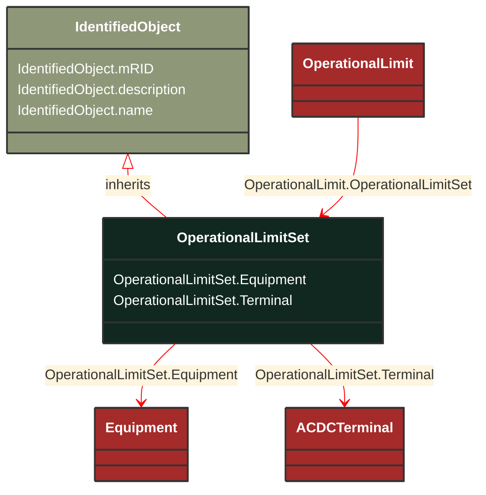

# OperationalLimitSet

_A set of limits associated with equipment.  Sets of limits might apply to a specific temperature, or season for example. A set of limits may contain different severities of limit levels that would apply to the same equipment. The set may contain limits of different types such as apparent power and current limits or high and low voltage limits  that are logically applied together as a set._

**URI**: [cim:OperationalLimitSet](https://cim.ucaiug.io/ns#OperationalLimitSet) 
**Type**: Class

## Inheritance
* [IdentifiedObject](/Models/Profiles/Telemark-120Equipment/AbstractClasses/IdentifiedObject/)
    * **OperationalLimitSet**

## Attributes
| Name | URI | Cardinality and Range | Description | Inheritance |
| ---  | --- | --- | --- | --- |
| Equipment | [cim:OperationalLimitSet.Equipment](https://cim.ucaiug.io/ns#OperationalLimitSet.Equipment) | 0..1 Equipment | The equipment to which the limit set applies. | direct |
| Terminal | [cim:OperationalLimitSet.Terminal](https://cim.ucaiug.io/ns#OperationalLimitSet.Terminal) | 0..1 ACDCTerminal | The terminal where the operational limit set apply. | direct |
| mRID | [cim:IdentifiedObject.mRID](https://cim.ucaiug.io/ns#IdentifiedObject.mRID) | 0..1 string | Master resource identifier issued by a model authority. The mRID is unique within an exchange context. Global uniqueness is easily achieved by using a UUID, as specified in RFC 4122, for the mRID. The use of UUID is strongly recommended.For CIMXML data files in RDF syntax conforming to IEC 61970-552, the mRID is mapped to rdf:ID or rdf:about attributes that identify CIM object elements. | IdentifiedObject |
| description | [cim:IdentifiedObject.description](https://cim.ucaiug.io/ns#IdentifiedObject.description) | 0..1 string | The description is a free human readable text describing or naming the object. It may be non unique and may not correlate to a naming hierarchy. | IdentifiedObject |
| name | [cim:IdentifiedObject.name](https://cim.ucaiug.io/ns#IdentifiedObject.name) | 0..1 string | The name is any free human readable and possibly non unique text naming the object. | IdentifiedObject |

### Schema Source
* from schema: [https://ap-no.cim4.eu/Equipment/1.0](https://ap-no.cim4.eu/Equipment/1.0)
