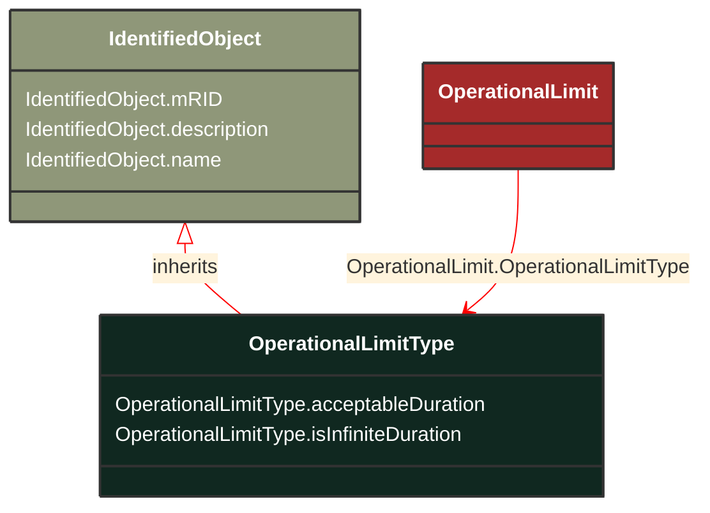

# OperationalLimitType

_The operational meaning of a category of limits._

**URI**: [cim:OperationalLimitType](https://cim.ucaiug.io/ns#OperationalLimitType) 
**Type**: Class

## Inheritance
* [IdentifiedObject](IdentifiedObject.md)
    * **OperationalLimitType**

## Attributes
| Name | URI | Cardinality and Range | Description | Inheritance |
| ---  | --- | --- | --- | --- |
| acceptableDuration | [cim:OperationalLimitType.acceptableDuration](https://cim.ucaiug.io/ns#OperationalLimitType.acceptableDuration) | 0..1 Seconds | The nominal acceptable duration of the limit. Limits are commonly expressed in terms of the time limit for which the limit is normally acceptable. The actual acceptable duration of a specific limit may depend on other local factors such as temperature or wind speed. The attribute has meaning only if the flag isInfiniteDuration is set to false, hence it shall not be exchanged when isInfiniteDuration is set to true. | direct |
| isInfiniteDuration | [cim:OperationalLimitType.isInfiniteDuration](https://cim.ucaiug.io/ns#OperationalLimitType.isInfiniteDuration) | 0..1 boolean | Defines if the operational limit type has infinite duration. If true, the limit has infinite duration. If false, the limit has definite duration which is defined by the attribute acceptableDuration. | direct |
| mRID | [cim:IdentifiedObject.mRID](https://cim.ucaiug.io/ns#IdentifiedObject.mRID) | 0..1 string | Master resource identifier issued by a model authority. The mRID is unique within an exchange context. Global uniqueness is easily achieved by using a UUID, as specified in RFC 4122, for the mRID. The use of UUID is strongly recommended.For CIMXML data files in RDF syntax conforming to IEC 61970-552, the mRID is mapped to rdf:ID or rdf:about attributes that identify CIM object elements. | IdentifiedObject |
| description | [cim:IdentifiedObject.description](https://cim.ucaiug.io/ns#IdentifiedObject.description) | 0..1 string | The description is a free human readable text describing or naming the object. It may be non unique and may not correlate to a naming hierarchy. | IdentifiedObject |
| name | [cim:IdentifiedObject.name](https://cim.ucaiug.io/ns#IdentifiedObject.name) | 0..1 string | The name is any free human readable and possibly non unique text naming the object. | IdentifiedObject |

### Schema Source
* from schema: [https://ap-no.cim4.eu/Equipment/1.0](https://ap-no.cim4.eu/Equipment/1.0)
