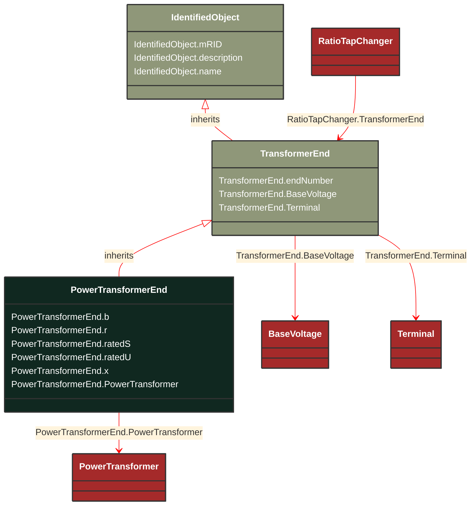

# PowerTransformerEnd

_A PowerTransformerEnd is associated with each Terminal of a PowerTransformer.The impedance values r, r0, x, and x0 of a PowerTransformerEnd represents a star equivalent as follows.1) for a two Terminal PowerTransformer the high voltage (TransformerEnd.endNumber=1) PowerTransformerEnd has non zero values on r, r0, x, and x0 while the low voltage (TransformerEnd.endNumber=2) PowerTransformerEnd has zero values for r, r0, x, and x0.  Parameters are always provided, even if the PowerTransformerEnds have the same rated voltage.  In this case, the parameters are provided at the PowerTransformerEnd which has TransformerEnd.endNumber equal to 1.2) for a three Terminal PowerTransformer the three PowerTransformerEnds represent a star equivalent with each leg in the star represented by r, r0, x, and x0 values.3) For a three Terminal transformer each PowerTransformerEnd shall have g, g0, b and b0 values corresponding to the no load losses distributed on the three PowerTransformerEnds. The total no load loss shunt impedances may also be placed at one of the PowerTransformerEnds, preferably the end numbered 1, having the shunt values on end 1.  This is the preferred way.4) for a PowerTransformer with more than three Terminals the PowerTransformerEnd impedance values cannot be used. Instead use the TransformerMeshImpedance or split the transformer into multiple PowerTransformers.Each PowerTransformerEnd must be contained by a PowerTransformer. Because a PowerTransformerEnd (or any other object) can not be contained by more than one parent, a PowerTransformerEnd can not have an association to an EquipmentContainer (Substation, VoltageLevel, etc)._

**URI**: [cim:PowerTransformerEnd](https://cim.ucaiug.io/ns#PowerTransformerEnd) 
**Type**: Class

## Inheritance
* [IdentifiedObject](/Models/Profiles/Telemark-120Equipment/AbstractClasses/IdentifiedObject/)
    * [TransformerEnd](/Models/Profiles/Telemark-120Equipment/AbstractClasses/TransformerEnd/)
        * **PowerTransformerEnd**

## Attributes
| Name | URI | Cardinality and Range | Description | Inheritance |
| ---  | --- | --- | --- | --- |
| b | [cim:PowerTransformerEnd.b](https://cim.ucaiug.io/ns#PowerTransformerEnd.b) | 0..1 Susceptance | Magnetizing branch susceptance (B mag).  The value can be positive or negative. | direct |
| r | [cim:PowerTransformerEnd.r](https://cim.ucaiug.io/ns#PowerTransformerEnd.r) | 0..1 Resistance | Resistance (star-model) of the transformer end.The attribute shall be equal to or greater than zero for non-equivalent transformers. | direct |
| ratedS | [cim:PowerTransformerEnd.ratedS](https://cim.ucaiug.io/ns#PowerTransformerEnd.ratedS) | 0..1 ApparentPower | Normal apparent power rating.The attribute shall be a positive value. For a two-winding transformer the values for the high and low voltage sides shall be identical. | direct |
| ratedU | [cim:PowerTransformerEnd.ratedU](https://cim.ucaiug.io/ns#PowerTransformerEnd.ratedU) | 0..1 Voltage | Rated voltage: phase-phase for three-phase windings, and either phase-phase or phase-neutral for single-phase windings.A high voltage side, as given by TransformerEnd.endNumber, shall have a ratedU that is greater than or equal to ratedU for the lower voltage sides.The attribute shall be a positive value. | direct |
| x | [cim:PowerTransformerEnd.x](https://cim.ucaiug.io/ns#PowerTransformerEnd.x) | 0..1 Reactance | Positive sequence series reactance (star-model) of the transformer end. | direct |
| PowerTransformer | [cim:PowerTransformerEnd.PowerTransformer](https://cim.ucaiug.io/ns#PowerTransformerEnd.PowerTransformer) | 0..1 PowerTransformer | The power transformer of this power transformer end. | direct |
| endNumber | [cim:TransformerEnd.endNumber](https://cim.ucaiug.io/ns#TransformerEnd.endNumber) | 0..1 integer | Number for this transformer end, corresponding to the end's order in the power transformer vector group or phase angle clock number.  Highest voltage winding should be 1.  Each end within a power transformer should have a unique subsequent end number.   Note the transformer end number need not match the terminal sequence number. | TransformerEnd |
| BaseVoltage | [cim:TransformerEnd.BaseVoltage](https://cim.ucaiug.io/ns#TransformerEnd.BaseVoltage) | 0..1 BaseVoltage | Base voltage of the transformer end.  This is essential for PU calculation. | TransformerEnd |
| Terminal | [cim:TransformerEnd.Terminal](https://cim.ucaiug.io/ns#TransformerEnd.Terminal) | 0..1 Terminal | Terminal of the power transformer to which this transformer end belongs. | TransformerEnd |
| mRID | [cim:IdentifiedObject.mRID](https://cim.ucaiug.io/ns#IdentifiedObject.mRID) | 0..1 string | Master resource identifier issued by a model authority. The mRID is unique within an exchange context. Global uniqueness is easily achieved by using a UUID, as specified in RFC 4122, for the mRID. The use of UUID is strongly recommended.For CIMXML data files in RDF syntax conforming to IEC 61970-552, the mRID is mapped to rdf:ID or rdf:about attributes that identify CIM object elements. | IdentifiedObject |
| description | [cim:IdentifiedObject.description](https://cim.ucaiug.io/ns#IdentifiedObject.description) | 0..1 string | The description is a free human readable text describing or naming the object. It may be non unique and may not correlate to a naming hierarchy. | IdentifiedObject |
| name | [cim:IdentifiedObject.name](https://cim.ucaiug.io/ns#IdentifiedObject.name) | 0..1 string | The name is any free human readable and possibly non unique text naming the object. | IdentifiedObject |

### Schema Source
* from schema: [https://ap-no.cim4.eu/Equipment/1.0](https://ap-no.cim4.eu/Equipment/1.0)
