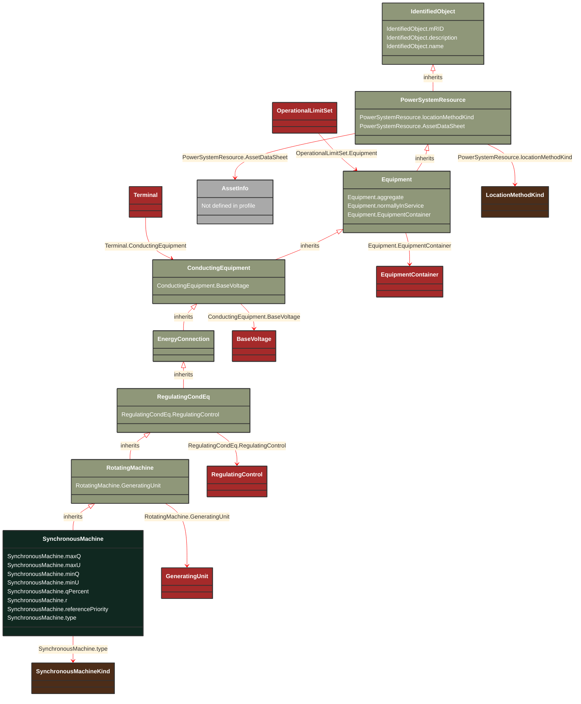

# SynchronousMachine

_An electromechanical device that operates with shaft rotating synchronously with the network. It is a single machine operating either as a generator or synchronous condenser or pump._

**URI**: [cim:SynchronousMachine](https://cim.ucaiug.io/ns#SynchronousMachine) 
**Type**: Class

## Inheritance
* [IdentifiedObject](/Models/Profiles/Telemark-120Equipment/AbstractClasses/IdentifiedObject/)
    * [PowerSystemResource](/Models/Profiles/Telemark-120Equipment/AbstractClasses/PowerSystemResource/)
        * [Equipment](/Models/Profiles/Telemark-120Equipment/AbstractClasses/Equipment/)
            * [ConductingEquipment](/Models/Profiles/Telemark-120Equipment/AbstractClasses/ConductingEquipment/)
                * [EnergyConnection](/Models/Profiles/Telemark-120Equipment/AbstractClasses/EnergyConnection/)
                    * [RegulatingCondEq](/Models/Profiles/Telemark-120Equipment/AbstractClasses/RegulatingCondEq/)
                        * [RotatingMachine](/Models/Profiles/Telemark-120Equipment/AbstractClasses/RotatingMachine/)
                            * **SynchronousMachine**

## Attributes
| Name | URI | Cardinality and Range | Description | Inheritance |
| ---  | --- | --- | --- | --- |
| maxQ | [cim:SynchronousMachine.maxQ](https://cim.ucaiug.io/ns#SynchronousMachine.maxQ) | 0..1 ReactivePower | Maximum reactive power limit. This is the maximum (nameplate) limit for the unit. | direct |
| maxU | [cim:SynchronousMachine.maxU](https://cim.ucaiug.io/ns#SynchronousMachine.maxU) | 0..1 Voltage | Maximum voltage limit for the unit. | direct |
| minQ | [cim:SynchronousMachine.minQ](https://cim.ucaiug.io/ns#SynchronousMachine.minQ) | 0..1 ReactivePower | Minimum reactive power limit for the unit. | direct |
| minU | [cim:SynchronousMachine.minU](https://cim.ucaiug.io/ns#SynchronousMachine.minU) | 0..1 Voltage | Minimum voltage  limit for the unit. | direct |
| qPercent | [cim:SynchronousMachine.qPercent](https://cim.ucaiug.io/ns#SynchronousMachine.qPercent) | 0..1 PerCent | Part of the coordinated reactive control that comes from this machine. The attribute is used as a participation factor not necessarily summing up to 100% for the participating devices in the control. | direct |
| r | [cim:SynchronousMachine.r](https://cim.ucaiug.io/ns#SynchronousMachine.r) | 0..1 Resistance | Equivalent resistance (RG) of generator. RG is considered for the calculation of all currents, except for the calculation of the peak current ip. Used for short circuit data exchange according to IEC 60909. | direct |
| referencePriority | [cim:SynchronousMachine.referencePriority](https://cim.ucaiug.io/ns#SynchronousMachine.referencePriority) | 0..1 integer | Priority of unit for use as powerflow voltage phase angle reference bus selection. 0 = don t care (default) 1 = highest priority. 2 is less than 1 and so on. | direct |
| type | [cim:SynchronousMachine.type](https://cim.ucaiug.io/ns#SynchronousMachine.type) | 0..1 SynchronousMachineKind | Modes that this synchronous machine can operate in. | direct |
| GeneratingUnit | [cim:RotatingMachine.GeneratingUnit](https://cim.ucaiug.io/ns#RotatingMachine.GeneratingUnit) | 0..1 GeneratingUnit | A synchronous machine may operate as a generator and as such becomes a member of a generating unit. | RotatingMachine |
| RegulatingControl | [cim:RegulatingCondEq.RegulatingControl](https://cim.ucaiug.io/ns#RegulatingCondEq.RegulatingControl) | 0..1 RegulatingControl | The regulating control scheme in which this equipment participates. | RegulatingCondEq |
| BaseVoltage | [cim:ConductingEquipment.BaseVoltage](https://cim.ucaiug.io/ns#ConductingEquipment.BaseVoltage) | 0..1 BaseVoltage | Base voltage of this conducting equipment.  Use only when there is no voltage level container used and only one base voltage applies.  For example, not used for transformers. | ConductingEquipment |
| aggregate | [cim:Equipment.aggregate](https://cim.ucaiug.io/ns#Equipment.aggregate) | 0..1 boolean | The aggregate attribute is used to indicate that the object is an aggregate of other objects. The aggregate attribute is used to indicate that the object is an aggregate of other objects. The aggregate attribute is used to indicate that the object is an aggregate of other objects. | Equipment |
| normallyInService | [cim:Equipment.normallyInService](https://cim.ucaiug.io/ns#Equipment.normallyInService) | 0..1 boolean | The normallyInService attribute is used to indicate that the object is normally in service. The normallyInService attribute is used to indicate that the object is normally in service. The normallyInService attribute is used to indicate that the object is normally in service. | Equipment |
| EquipmentContainer | [cim:Equipment.EquipmentContainer](https://cim.ucaiug.io/ns#Equipment.EquipmentContainer) | 0..1 EquipmentContainer | Container of this equipment. | Equipment |
| locationMethodKind | [nc-no:PowerSystemResource.locationMethodKind](http://cim4.eu/ns/nc-no#PowerSystemResource.locationMethodKind) | 0..1 LocationMethodKind | Possible methods to derive geographical location. | PowerSystemResource |
| AssetDataSheet | [cim:PowerSystemResource.AssetDataSheet](https://cim.ucaiug.io/ns#PowerSystemResource.AssetDataSheet) | 0..1 AssetInfo | Datasheet information for this power system resource. | PowerSystemResource |
| mRID | [cim:IdentifiedObject.mRID](https://cim.ucaiug.io/ns#IdentifiedObject.mRID) | 0..1 string | Master resource identifier issued by a model authority. The mRID is unique within an exchange context. Global uniqueness is easily achieved by using a UUID, as specified in RFC 4122, for the mRID. The use of UUID is strongly recommended.For CIMXML data files in RDF syntax conforming to IEC 61970-552, the mRID is mapped to rdf:ID or rdf:about attributes that identify CIM object elements. | IdentifiedObject |
| description | [cim:IdentifiedObject.description](https://cim.ucaiug.io/ns#IdentifiedObject.description) | 0..1 string | The description is a free human readable text describing or naming the object. It may be non unique and may not correlate to a naming hierarchy. | IdentifiedObject |
| name | [cim:IdentifiedObject.name](https://cim.ucaiug.io/ns#IdentifiedObject.name) | 0..1 string | The name is any free human readable and possibly non unique text naming the object. | IdentifiedObject |

### Schema Source
* from schema: [https://ap-no.cim4.eu/Equipment/1.0](https://ap-no.cim4.eu/Equipment/1.0)
