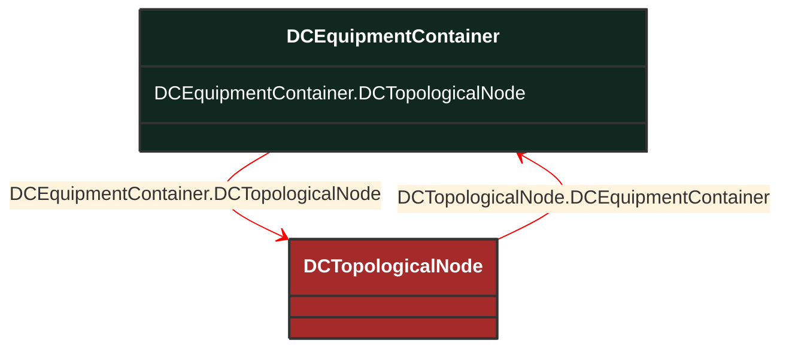

# DCEquipmentContainer

_A modelling construct to provide a root class for containment of DC as well as AC equipment. The class differ from the EquipmentContaner for AC in that it may also contain DCNode-s. Hence it can contain both AC and DC equipment._

*__NOTE__: this is an abstract class and should not be instantiated directly

**URI**: [cim:DCEquipmentContainer](http://iec.ch/TC57/CIM100#DCEquipmentContainer) 
**Type**: Class

## Inheritance
* **DCEquipmentContainer**

## Attributes
| Name | URI | Cardinality and Range | Description | Inheritance |
| ---  | --- | --- | --- | --- |
| DCTopologicalNode | [cim:DCEquipmentContainer.DCTopologicalNode](http://iec.ch/TC57/CIM100#DCEquipmentContainer.DCTopologicalNode) | No cardinality available DCTopologicalNode | The topological nodes which belong to this connectivity node container. | direct |

### Schema Source
* from schema: [http://iec.ch/TC57/ns/CIM/Topology-EUPackage_TopologyProfile](http://iec.ch/TC57/ns/CIM/Topology-EUPackage_TopologyProfile)
