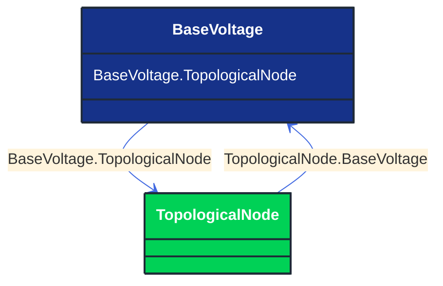

# BaseVoltage

_Defines a system base voltage which is referenced._

**URI**: [cim:BaseVoltage](http://iec.ch/TC57/CIM100#BaseVoltage) 
**Type**: Class

## Inheritance
* **BaseVoltage**

## Attributes
| Name | URI | Cardinality and Range | Description | Inheritance |
| ---  | --- | --- | --- | --- |
| TopologicalNode | [cim:BaseVoltage.TopologicalNode](http://iec.ch/TC57/CIM100#BaseVoltage.TopologicalNode) | No cardinality available TopologicalNode | The topological nodes at the base voltage. | direct |

### Schema Source
* from schema: [http://iec.ch/TC57/ns/CIM/Topology-EUPackage_TopologyProfile](http://iec.ch/TC57/ns/CIM/Topology-EUPackage_TopologyProfile)
