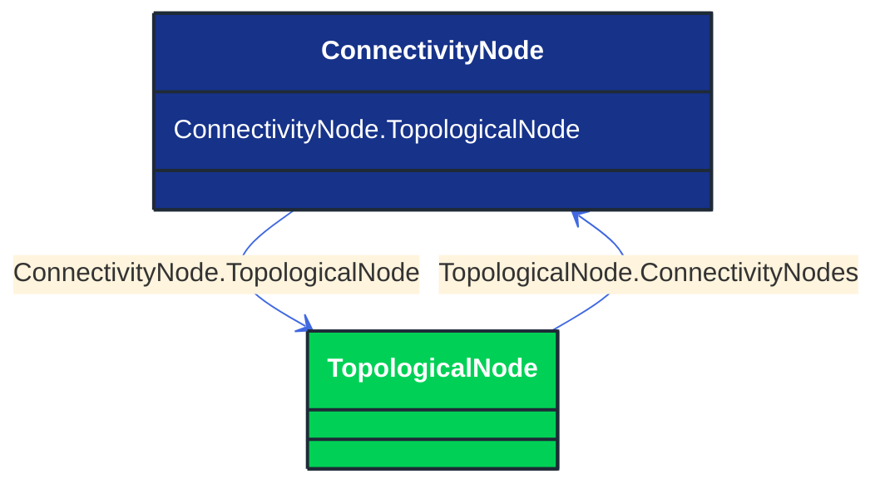

# ConnectivityNode

_Connectivity nodes are points where terminals of AC conducting equipment are connected together with zero impedance._

**URI**: [cim:ConnectivityNode](http://iec.ch/TC57/CIM100#ConnectivityNode) 
**Type**: Class

## Inheritance
* **ConnectivityNode**

## Attributes
| Name | URI | Cardinality and Range | Description | Inheritance |
| ---  | --- | --- | --- | --- |
| TopologicalNode | [cim:ConnectivityNode.TopologicalNode](http://iec.ch/TC57/CIM100#ConnectivityNode.TopologicalNode) | No cardinality available TopologicalNode | The topological node to which this connectivity node is assigned.  May depend on the current state of switches in the network. | direct |

### Schema Source
* from schema: [http://iec.ch/TC57/ns/CIM/Topology-EUPackage_TopologyProfile](http://iec.ch/TC57/ns/CIM/Topology-EUPackage_TopologyProfile)
