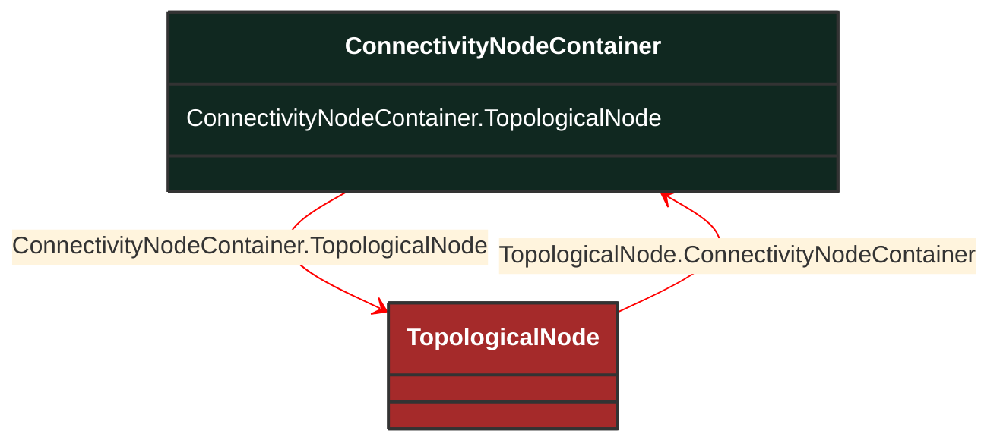

# ConnectivityNodeContainer

_A base class for all objects that may contain connectivity nodes or topological nodes._

**URI**: [cim:ConnectivityNodeContainer](http://iec.ch/TC57/CIM100#ConnectivityNodeContainer) 
**Type**: Class

## Inheritance
* **ConnectivityNodeContainer**

## Attributes
| Name | URI | Cardinality and Range | Description | Inheritance |
| ---  | --- | --- | --- | --- |
| TopologicalNode | [cim:ConnectivityNodeContainer.TopologicalNode](http://iec.ch/TC57/CIM100#ConnectivityNodeContainer.TopologicalNode) | No cardinality available TopologicalNode | The topological nodes which belong to this connectivity node container. | direct |

### Schema Source
* from schema: [http://iec.ch/TC57/ns/CIM/Topology-EUPackage_TopologyProfile](http://iec.ch/TC57/ns/CIM/Topology-EUPackage_TopologyProfile)
