# TopologicalNode

_For a detailed substation model a topological node is a set of connectivity nodes that, in the current network state, are connected together through any type of closed switches, including  jumpers. Topological nodes change as the current network state changes (i.e., switches, breakers, etc. change state).
For a planning model, switch statuses are not used to form topological nodes. Instead they are manually created or deleted in a model builder tool. Topological nodes maintained this way are also called "busses"._

**URI**: [cim:TopologicalNode](http://iec.ch/TC57/CIM100#TopologicalNode) 
**Type**: Class

```mermaid
%%{init: {'theme':'base','themeVariables': {'lineColor': '#FF0000'}}}%%
classDiagram
    class TopologicalNode
    click TopologicalNode href "/Models/Profiles/Topology/ConcreteClasses/TopologicalNode/"
    style TopologicalNode fill:#102820,stroke:#333,stroke-width:2px,rx:10,ry:10,color:white
     
        IdentifiedObject <|-- TopologicalNode : inherits
            click IdentifiedObject href "/Models/Profiles/Topology/AbstractClasses/IdentifiedObject/"
            style IdentifiedObject fill:#8F9779,stroke:#333,stroke-width:2px,rx:10,ry:10,color:white

        TopologicalNode --> BaseVoltage : TopologicalNode.BaseVoltage

        BaseVoltage
            click BaseVoltage href "/Models/Profiles/Topology/ConcreteClasses/BaseVoltage/"
            style BaseVoltage fill:#A52A2A,stroke:#333,stroke-width:2px,rx:10,ry:10,color:white
        TopologicalNode --> ConnectivityNode : TopologicalNode.ConnectivityNodes

        ConnectivityNode
            click ConnectivityNode href "/Models/Profiles/Topology/ConcreteClasses/ConnectivityNode/"
            style ConnectivityNode fill:#A52A2A,stroke:#333,stroke-width:2px,rx:10,ry:10,color:white
        TopologicalNode --> ConnectivityNodeContainer : TopologicalNode.ConnectivityNodeContainer

        ConnectivityNodeContainer
            click ConnectivityNodeContainer href "/Models/Profiles/Topology/AbstractClasses/ConnectivityNodeContainer/"
            style ConnectivityNodeContainer fill:#A52A2A,stroke:#333,stroke-width:2px,rx:10,ry:10,color:white
        TopologicalNode --> Terminal : TopologicalNode.Terminal

        Terminal
            click Terminal href "/Models/Profiles/Topology/ConcreteClasses/Terminal/"
            style Terminal fill:#A52A2A,stroke:#333,stroke-width:2px,rx:10,ry:10,color:white
        TopologicalNode --> ReportingGroup : TopologicalNode.ReportingGroup

        ReportingGroup
            click ReportingGroup href "/Models/Profiles/Topology/ConcreteClasses/ReportingGroup/"
            style ReportingGroup fill:#A52A2A,stroke:#333,stroke-width:2px,rx:10,ry:10,color:white

        BaseVoltage --> TopologicalNode : BaseVoltage.TopologicalNode

        BaseVoltage
            click BaseVoltage href "/Models/Profiles/Topology/ConcreteClasses/BaseVoltage/"
            style BaseVoltage fill:#A52A2A,stroke:#333,stroke-width:2px,rx:10,ry:10,color:white

        ConnectivityNode --> TopologicalNode : ConnectivityNode.TopologicalNode

        ConnectivityNode
            click ConnectivityNode href "/Models/Profiles/Topology/ConcreteClasses/ConnectivityNode/"
            style ConnectivityNode fill:#A52A2A,stroke:#333,stroke-width:2px,rx:10,ry:10,color:white

        ConnectivityNodeContainer --> TopologicalNode : ConnectivityNodeContainer.TopologicalNode

        ConnectivityNodeContainer
            click ConnectivityNodeContainer href "/Models/Profiles/Topology/AbstractClasses/ConnectivityNodeContainer/"
            style ConnectivityNodeContainer fill:#A52A2A,stroke:#333,stroke-width:2px,rx:10,ry:10,color:white

        Terminal --> TopologicalNode : Terminal.TopologicalNode

        Terminal
            click Terminal href "/Models/Profiles/Topology/ConcreteClasses/Terminal/"
            style Terminal fill:#A52A2A,stroke:#333,stroke-width:2px,rx:10,ry:10,color:white

        ReportingGroup --> TopologicalNode : ReportingGroup.TopologicalNode

        ReportingGroup
            click ReportingGroup href "/Models/Profiles/Topology/ConcreteClasses/ReportingGroup/"
            style ReportingGroup fill:#A52A2A,stroke:#333,stroke-width:2px,rx:10,ry:10,color:white


        TopologicalNode : TopologicalNode.BaseVoltage
        TopologicalNode : TopologicalNode.ConnectivityNodes
        TopologicalNode : TopologicalNode.ConnectivityNodeContainer
        TopologicalNode : TopologicalNode.Terminal
        TopologicalNode : TopologicalNode.ReportingGroup
        IdentifiedObject : IdentifiedObject.description
        IdentifiedObject : IdentifiedObject.energyIdentCodeEic
        IdentifiedObject : IdentifiedObject.mRID
        IdentifiedObject : IdentifiedObject.name
        IdentifiedObject : IdentifiedObject.shortName
```

## Inheritance
* [IdentifiedObject](/Models/Profiles/Topology/AbstractClasses/IdentifiedObject/)
    * **TopologicalNode**

## Attributes
| Name | URI | Cardinality and Range | Description | Inheritance |
| ---  | --- | --- | --- | --- |
| BaseVoltage | [cim:TopologicalNode.BaseVoltage](http://iec.ch/TC57/CIM100#TopologicalNode.BaseVoltage) | No cardinality available BaseVoltage | The base voltage of the topological node. | direct |
| ConnectivityNodes | [cim:TopologicalNode.ConnectivityNodes](http://iec.ch/TC57/CIM100#TopologicalNode.ConnectivityNodes) | No cardinality available ConnectivityNode | The connectivity nodes combine together to form this topological node.  May depend on the current state of switches in the network. | direct |
| ConnectivityNodeContainer | [cim:TopologicalNode.ConnectivityNodeContainer](http://iec.ch/TC57/CIM100#TopologicalNode.ConnectivityNodeContainer) | No cardinality available ConnectivityNodeContainer | The connectivity node container to which the topological node belongs. | direct |
| Terminal | [cim:TopologicalNode.Terminal](http://iec.ch/TC57/CIM100#TopologicalNode.Terminal) | No cardinality available Terminal | The terminals associated with the topological node.   This can be used as an alternative to the connectivity node path to terminal, thus making it unnecessary to model connectivity nodes in some cases.   Note that if connectivity nodes are in the model, this association would probably not be used as an input specification. | direct |
| ReportingGroup | [cim:TopologicalNode.ReportingGroup](http://iec.ch/TC57/CIM100#TopologicalNode.ReportingGroup) | No cardinality available ReportingGroup | The reporting group to which the topological node belongs. | direct |
| description | [cim:IdentifiedObject.description](http://iec.ch/TC57/CIM100#IdentifiedObject.description) | No cardinality available string | The description is a free human readable text describing or naming the object. It may be non unique and may not correlate to a naming hierarchy. | IdentifiedObject |
| energyIdentCodeEic | [eu:IdentifiedObject.energyIdentCodeEic](http://iec.ch/TC57/CIM100-European#IdentifiedObject.energyIdentCodeEic) | No cardinality available string | The attribute is used for an exchange of the EIC code (Energy identification Code). The length of the string is 16 characters as defined by the EIC code. For details on EIC scheme please refer to ENTSO-E web site. | IdentifiedObject |
| mRID | [cim:IdentifiedObject.mRID](http://iec.ch/TC57/CIM100#IdentifiedObject.mRID) | No cardinality available string | Master resource identifier issued by a model authority. The mRID is unique within an exchange context. Global uniqueness is easily achieved by using a UUID, as specified in RFC 4122, for the mRID. The use of UUID is strongly recommended.
For CIMXML data files in RDF syntax conforming to IEC 61970-552, the mRID is mapped to rdf:ID or rdf:about attributes that identify CIM object elements. | IdentifiedObject |
| name | [cim:IdentifiedObject.name](http://iec.ch/TC57/CIM100#IdentifiedObject.name) | No cardinality available string | The name is any free human readable and possibly non unique text naming the object. | IdentifiedObject |
| shortName | [eu:IdentifiedObject.shortName](http://iec.ch/TC57/CIM100-European#IdentifiedObject.shortName) | No cardinality available string | The attribute is used for an exchange of a human readable short name with length of the string 12 characters maximum. | IdentifiedObject |

### Schema Source
* from schema: [http://iec.ch/TC57/ns/CIM/Topology-EUPackage_TopologyProfile](http://iec.ch/TC57/ns/CIM/Topology-EUPackage_TopologyProfile)
